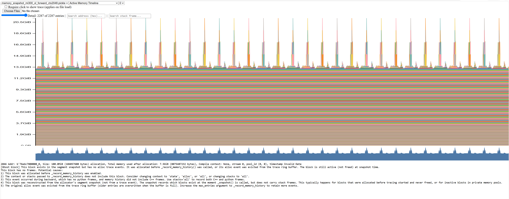
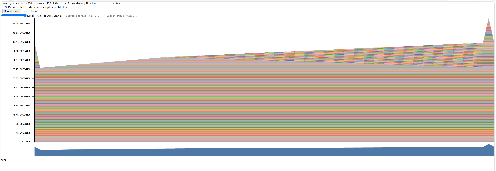

# CS336 Systems Benchmark Experiments

This document records the benchmark experiments run for Assignment 2 Section 2.1. Most initial benchmark runs used an NVIDIA H100 80GB GPU with random token data, vocabulary size 10,000, batch size 4, context length 512, dtype `float32`, and 10 measurement steps. Later comparison and attention-level profiling runs used an NVIDIA Tesla V100-SXM2-32GB. Memory profiling used PyTorch memory snapshots on V100 and AMD MI300X/ROCm, because the larger MI300X memory capacity allowed more of the `xl` experiments to complete.
## Code

Benchmark script:

- `cs336_systems/benchmarking.py`
## Terminology

Forward pass: The model receives a batch of token IDs and computes logits for the next-token prediction task. This measures inference-style compute only; no gradients are computed and model weights are not updated.

Backward pass: After a forward pass and loss computation, PyTorch computes gradients for the model parameters by backpropagation. In this report, "forward + backward" includes the forward pass, loss computation, and gradient computation, but does not include an optimizer update.

Warmup steps: Extra untimed iterations run before collecting measurements. These help exclude one-time overheads such as CUDA setup, kernel loading, memory allocator initialization, cache warming, and library autotuning from the measured timings.

Full train step: One complete optimization iteration. It clears old gradients, runs the forward pass, computes the loss, runs the backward pass, and applies the optimizer update to the model weights.

Standard deviation: The amount of variation across the 10 measured timings for the same operation. A small standard deviation means repeated measurements were consistent and the mean is reliable; a large standard deviation means the benchmark was noisy, often because one-time setup costs were included in the timed steps.

GEMM: General matrix multiplication. GEMM kernels compute matrix products such as $C = A B$ or layout variants of that operation. In Transformer models, most linear layers and attention matrix multiplications become GEMM kernels.

Kernel-name notation: Nsight and CUDA libraries use compact kernel names that encode architecture, math type, matrix layout, and tiling strategy. For example, a name like `sm80_xmma_gemm_f32f32_f32f32_f32_tn_n_tilesize128x128x8_stage3...` can be read as an optimized GPU GEMM kernel rather than hand-written model code.

Common pieces of GEMM kernel names:

| Name part | Meaning |
| --- | --- |
| `sm80` | GPU architecture target used by the kernel implementation. |
| `xmma` | Optimized matrix multiply-accumulate kernel family. |
| `gemm` | General matrix multiplication. Treat these as matmul kernels in the analysis. |
| `f32` | Float32 data type or accumulation/output component. |
| `nn` | Left matrix normal, right matrix normal: $A B$. |
| `tn` | Left matrix transposed, right matrix normal: $A^T B$. |
| `nt` | Left matrix normal, right matrix transposed: $A B^T$. |
| `tilesize128x128x8` | The GEMM is computed in blocks, roughly $128 \times 128 \times 8$ at a time. |
| `stage3` | The kernel uses a three-stage internal pipeline to overlap memory movement and compute. |
| `warpsize2x2x1` | How GPU warps are arranged over the tile. |
| `ffma` | Uses fused floating-point multiply-add instructions. |
| `aligna4`, `alignc4` | Memory alignment assumptions for input or output matrices. |

Transformer source of GEMM kernels: In this benchmark, GEMM kernels likely come from Q/K/V projections, attention score computation such as $QK^T$, attention-value multiplication, attention output projection, feed-forward/SwiGLU linear layers, and the final logits projection. Elementwise and reduction kernels usually come from operations such as activation functions, residual additions, normalization arithmetic, softmax pieces, and optimizer or loss-related tensor operations.
## Experiment Inventory

| Experiment | Purpose | Status |
| --- | --- | --- |
| Small model, 5 warmup steps | Time forward, forward + backward, and full train step | Completed |
| Small model, 0 warmup steps | Measure effect of skipping warmup | Completed |
| Small model, 2 warmup steps | Measure whether a small amount of warmup is enough | Completed |
| Forward model-size sweep | Compare forward-only runtime for small, medium, and large models | Completed |
| Small model, 5 warmup steps on V100 | Repeat forward, forward + backward, and full train step on V100 | Completed |
| V100 mixed precision | Compare FP32 baseline against FP16/BF16 autocast on V100 | FP16 completed; BF16 unsupported on V100 |
| Attention-level forward profile | Compare self-attention score matmul, softmax, mask, and value matmul | Completed on V100 |
| PyTorch memory profiling | Capture `xl` active memory timelines and peak memory at context lengths 128 and 2048 | Forward completed at both context lengths; train-step completed at 128 and OOMed at 2048 |
## Section 2.1.3 End-to-End Benchmarking
### Small Model With Warmup

Settings: `small`, batch size 4, context length 512, 5 warmup steps, 10 measurement steps, H100.

| Mode | Mean time | Std dev | Peak memory |
| --- | ---: | ---: | ---: |
| Forward | 20.077 ms | 0.049 ms | 0.735 GiB |
| Forward + backward | 62.914 ms | 0.465 ms | 4.107 GiB |
| Full train step | 66.606 ms | 0.220 ms | 5.068 GiB |

Observations:

- The backward pass dominates runtime. Forward + backward is about 3.13x the forward-only time.
- The optimizer step adds about 3.69 ms beyond forward + backward.
- Peak memory rises from 0.735 GiB for forward-only to 4.107 GiB for forward + backward, then to 5.068 GiB for the full train step.
- Backward uses much more memory because PyTorch must keep forward activations such as hidden states, attention intermediates, feed-forward intermediates, and normalization inputs so it can compute gradients. It also allocates parameter gradients and backward temporary buffers. The full train step uses still more memory because AdamW keeps optimizer state such as first- and second-moment estimates.
- Standard deviations are small after warmup, so the benchmark is stable.
### Small Model With Warmup On V100

Settings: `small`, batch size 4, context length 512, 5 warmup steps, 10 measurement steps, V100.

| Mode | Mean time | Std dev | Peak memory |
| --- | ---: | ---: | ---: |
| Forward | 62.356 ms | 0.241 ms | 0.712 GiB |
| Forward + backward | 192.397 ms | 0.323 ms | 4.061 GiB |
| Full train step | 205.520 ms | 1.231 ms | 5.022 GiB |

Comparison against the H100 run:

| Mode | H100 mean | V100 mean | V100 / H100 |
| --- | ---: | ---: | ---: |
| Forward | 20.077 ms | 62.356 ms | 3.11x |
| Forward + backward | 62.914 ms | 192.397 ms | 3.06x |
| Full train step | 66.606 ms | 205.520 ms | 3.09x |

Observations:

- The V100 run is consistently about 3.1x slower than the H100 run for this small-model benchmark.
- The memory footprint is very similar between H100 and V100 because model size, batch size, context length, dtype, and optimizer are the same. The main difference is compute throughput, not the amount of memory needed.
- The timing pattern is the same on both GPUs: backward dominates runtime, and the optimizer step adds a smaller amount of time beyond forward + backward.
### No-Warmup Comparison

Settings: `small`, batch size 4, context length 512, 0 warmup steps, 10 measurement steps.

| Mode | Mean time | Std dev | Peak memory |
| --- | ---: | ---: | ---: |
| Forward | 35.097 ms | 48.296 ms | 0.735 GiB |
| Forward + backward | 72.873 ms | 32.982 ms | 4.107 GiB |
| Full train step | 67.833 ms | 4.587 ms | 5.068 GiB |

Comparison against the 5-warmup run:

| Mode | 5-warmup mean | No-warmup mean | 5-warmup std | No-warmup std |
| --- | ---: | ---: | ---: | ---: |
| Forward | 20.077 ms | 35.097 ms | 0.049 ms | 48.296 ms |
| Forward + backward | 62.914 ms | 72.873 ms | 0.465 ms | 32.982 ms |
| Full train step | 66.606 ms | 67.833 ms | 0.220 ms | 4.587 ms |

Observations:

- Without warmup, means are higher for forward and forward + backward.
- The bigger effect is variance: forward std dev jumps from 0.049 ms to 48.296 ms, and forward + backward std dev jumps from 0.465 ms to 32.982 ms.
- This likely happens because the timed region includes one-time CUDA setup, memory allocator setup, kernel loading, cache effects, and library autotuning.
- Using only 1 or 2 warmup steps may still differ from using 5 because some one-time costs can persist for more than the first iteration.
### Two-Warmup Comparison

Settings: `small`, batch size 4, context length 512, 2 warmup steps, 10 measurement steps.

| Mode | Mean time | Std dev | Peak memory |
| --- | ---: | ---: | ---: |
| Forward | 19.889 ms | 0.042 ms | 0.735 GiB |
| Forward + backward | 62.199 ms | 0.218 ms | 4.107 GiB |
| Full train step | 65.853 ms | 0.166 ms | 5.068 GiB |

Warmup-step comparison:

| Mode | 0-warmup mean | 2-warmup mean | 5-warmup mean | 0-warmup std | 2-warmup std | 5-warmup std |
| --- | ---: | ---: | ---: | ---: | ---: | ---: |
| Forward | 35.097 ms | 19.889 ms | 20.077 ms | 48.296 ms | 0.042 ms | 0.049 ms |
| Forward + backward | 72.873 ms | 62.199 ms | 62.914 ms | 32.982 ms | 0.218 ms | 0.465 ms |
| Full train step | 67.833 ms | 65.853 ms | 66.606 ms | 4.587 ms | 0.166 ms | 0.220 ms |

Observations:

- Two warmup steps were enough to remove most of the high variance seen with zero warmup steps.
- The 2-warmup and 5-warmup measurements are very close, suggesting the main one-time overheads were paid during the first two untimed iterations for this setup.
- The 2-warmup run is slightly faster than the 5-warmup run, but the difference is small enough that it is likely ordinary run-to-run variation rather than a meaningful speed difference.
### Forward Model-Size Sweep

Settings: forward-only, batch size 4, context length 512, 5 warmup steps, 10 measurement steps.

| Size | Parameters | Mean time | Std dev | Peak memory |
| --- | ---: | ---: | ---: | ---: |
| small | 128.6M | 19.858 ms | 0.044 ms | 0.735 GiB |
| medium | 423.2M | 54.571 ms | 0.058 ms | 1.907 GiB |
| large | 969.4M | 122.593 ms | 0.081 ms | 4.099 GiB |

Observations:

- Forward runtime scales strongly with model size.
- Medium is about 2.75x slower than small.
- Large is about 6.17x slower than small.
- Peak memory also scales steadily, from 0.735 GiB for small to 4.099 GiB for large.
- The standard deviations remain very small after warmup, even as the model size increases.
### Writeup-Ready Text

For part (b): On an NVIDIA H100 80GB GPU with batch size 4 and context length 512, the small model took 20.077 +/- 0.049 ms for a forward pass, 62.914 +/- 0.465 ms for forward + backward, and 66.606 +/- 0.220 ms for a full optimizer step. Variability was very small after 5 warmup steps, indicating stable timing measurements.

For part (c): Removing warmup steps made the timing much noisier: forward-pass standard deviation increased from 0.049 ms to 48.296 ms, and forward + backward standard deviation increased from 0.465 ms to 32.982 ms. With 2 warmup steps, timings returned to stable values close to the 5-warmup run: forward took 19.889 +/- 0.042 ms, forward + backward took 62.199 +/- 0.218 ms, and a full train step took 65.853 +/- 0.166 ms. This likely happens because the first measured iterations without warmup include CUDA kernel initialization, memory allocator setup, cache warming, and library autotuning; in this setup, 2 warmup steps appear to be enough to exclude most of those one-time costs.

For model scaling: In the forward-only model-size sweep, small, medium, and large models took 19.858 ms, 54.571 ms, and 122.593 ms respectively. Runtime and memory both increased substantially with model size, with the large model using 4.099 GiB peak memory and running about 6.17x slower than the small model for forward-only inference under the same batch and context settings.
### Future Work

- Revisit `xl` after implementing memory or runtime optimizations. Start with forward-only mode, batch size 1, context length 512, 5 warmup steps, and 10 measurement steps.
- Revisit `10B` only after `xl` succeeds. Start with forward-only mode, batch size 1, context length 512, 5 warmup steps, and 10 measurement steps.
- Avoid backward or full train-step benchmarks for `xl` and `10B` until memory-saving techniques are available, because backward requires saved activations, gradients, temporary buffers, and optimizer state.
- Compare optimized results against the current small, medium, and large forward-only sweep to measure whether optimization changes scaling behavior.
## Section 2.1.4 Nsight Systems Profiling
### Profiling Workflow Todo

This section tracks the planned Nsight Systems profiling workflow for the next assignment section. The goal is to generate profiler trace files on an NVIDIA H100 80GB GPU, then inspect the trace files locally with the Nsight Systems desktop application.

1. Keep normal benchmarking separate.
	Normal benchmark runs use `cs336_systems/benchmarking.py` without profiler annotations enabled. This keeps the timing workflow from the previous section unchanged.

2. Use optional profiler annotations only for profiling.
	The benchmark script supports an opt-in `--enable-nvtx` flag. When enabled, the script labels `warmup`, `measurement`, `zero_grad`, `forward`, `loss`, `backward`, and `optimizer_step` regions for the profiler timeline. When the flag is absent, these labels are disabled.

3. Use the profiling submit helper.
	The profiling path uses the separate Nsight profile submit helper, which wraps the benchmark command with `nsys profile` and saves a profiler trace file under `outputs/`.

4. Install Nsight Systems in the job setup.
	The smoke profiling config installs Python dependencies, downloads the Nsight Systems Linux CLI package, extracts it into the user home directory without root permissions, and adds the extracted `nsys` binary to `PATH`. The command also runs `nsys --version` so the job log records which profiler version was used.

5. Start with one smoke profile.
	The smoke profile uses the small model, full train-step mode, batch size 4, context length 512, 2 warmup steps, and 1 measurement step. Profiling is slower and creates larger files than timing-only benchmarking, so the first run should be intentionally small.

6. Download the profiler artifacts.
	After the smoke profile finishes, download the generated `.nsys-rep` file and the small benchmark summary written alongside it. The expected profiler output name is `profile_smoke_small_ctx512_train_step.nsys-rep`.

7. Inspect the trace locally.
	Open the `.nsys-rep` file in the Nsight Systems desktop application. Check the timeline, CUDA GPU kernel summary, CUDA API summary, GPU utilization, and NVTX ranges.

8. Confirm that profiler labels are visible.
	In the timeline, verify that labels such as `warmup`, `measurement`, `forward`, `loss`, `backward`, and `optimizer_step` appear. These labels make it easier to attribute CUDA kernels to parts of the training step.

9. Run the assignment profiling grid after the smoke profile works.
	Use two model sizes and three power-of-two context lengths larger than 128. A practical starting grid is `small` and `medium` at context lengths 256, 512, and 1024.

10. Answer the profiling questions.
	Use the profiler summaries to identify total forward time, the CUDA kernels with the most cumulative GPU time, non-matmul kernels with nontrivial runtime, how full train-step kernel fractions differ from forward-only, and how softmax runtime compares with matrix multiplication runtime inside self-attention.
### Nsight Smoke Profile Findings

Settings: `small`, full train-step mode, batch size 4, context length 512, 2 warmup steps, 1 measurement step, H100.

The profiler labels were visible in the NVTX view. The profiled timing matched the benchmark timing closely: the `measurement` NVTX range took 68.714 ms, while the benchmark summary reported 68.691 ms for the measured train step.

NVTX timing breakdown:

| Region | Duration |
| --- | ---: |
| warmup | 594.296 ms |
| measurement | 68.714 ms |
| zero_grad | 445.781 us |
| forward | 21.560 ms |
| loss | 184.011 us |
| backward | 27.432 ms |
| optimizer_step | 2.173 ms |

Visible GPU hardware breakdown for the full profiled train step:

| GPU activity | Share |
| --- | ---: |
| Kernels | 74.1% |
| Memory | 25.9% |

Top visible kernel groups:

| Kernel group | Type | Share |
| --- | --- | ---: |
| `vectorized_elementwise_kernel` | non-matmul elementwise | 14.5% |
| `cutlass_80_simt_sgemm...` | matmul / GEMM | 14.2% |
| `elementwise_kernel` | non-matmul elementwise | 12.7% |
| `sm80_xmma_gemm...` | matmul / GEMM | 10.7% |
| `sm80_xmma_gemm...` | matmul / GEMM | 8.9% |

Memory activity within the profiled train step was dominated by host-to-device copies in the visible memory summary:

| Memory group | Share of memory activity |
| --- | ---: |
| HtoD memcpy | 98.8% |
| Memset | 0.6% |
| DtoD memcpy | 0.6% |

Observations:

- The profiler captured useful CUDA API, CUDA hardware, cuBLAS, and NVTX tracks.
- The GPU metrics rows showed some missing data, but the CUDA kernel timeline and NVTX ranges were still usable for assignment analysis.
- In the V100 environment used here, the Nsight GPU metrics sampler is not available, so later V100 profiles disable `--gpu-metrics-devices`. This is acceptable for the assignment questions because CUDA kernel summaries, CUDA API summaries, cuBLAS calls, and NVTX ranges are still available.
- For the full train-step profile, non-matmul elementwise kernels were nontrivial: the visible `vectorized_elementwise_kernel` and `elementwise_kernel` groups together accounted for about 27.2% of visible GPU kernel time.
- GEMM kernels were also major contributors: visible CUTLASS/cuBLAS-style GEMM groups accounted for at least 33.8% of visible GPU kernel time when summing the 14.2%, 10.7%, and 8.9% groups.
- These findings are for the full profiled train step. To answer the forward-pass-specific questions precisely, the next step is to zoom into the `forward` NVTX range and inspect only the CUDA kernels inside that range.

Command-line `nsys stats` was also run on the smoke profile. These statistics summarize the full captured profiling session, including the two warmup train steps and the one measured train step, so the percentages below should not be interpreted as forward-only percentages.

Top CUDA GPU kernel summary rows from `nsys stats`:

| Kernel group | Type | Time | Instances | Avg time | Share |
| --- | --- | ---: | ---: | ---: | ---: |
| `cutlass_80_simt_sgemm_256x128...` | matmul / GEMM | 26.449 ms | 219 | 120.771 us | 14.2% |
| `sm80_xmma_gemm...128x128...tn...` | matmul / GEMM | 19.938 ms | 183 | 108.953 us | 10.7% |
| `sm80_xmma_gemm...128x64...tn...` | matmul / GEMM | 16.568 ms | 72 | 230.107 us | 8.9% |
| `sm80_xmma_gemm...128x128...nn...` | matmul / GEMM | 16.483 ms | 75 | 219.778 us | 8.9% |
| `sm80_xmma_gemm...64x64...nn...` | matmul / GEMM | 11.977 ms | 216 | 55.449 us | 6.4% |
| `sm80_xmma_gemm...64x64...nt...` | matmul / GEMM | 11.811 ms | 108 | 109.360 us | 6.4% |
| `at::native::vectorized_elementwise_kernel...BinaryFunctor...` | non-matmul elementwise | 10.488 ms | 588 | 17.837 us | 5.6% |
| `sm80_xmma_gemm...256x128...nn...` | matmul / GEMM | 8.086 ms | 36 | 224.615 us | 4.3% |
| `at::native::elementwise_kernel...` | non-matmul elementwise | 6.983 ms | 144 | 48.492 us | 3.8% |
| `at::native::vectorized_elementwise_kernel...CUDAFunctor_add...` | non-matmul elementwise | 5.739 ms | 693 | 8.281 us | 3.1% |

CUDA API summary from `nsys stats`:

| CUDA API | Time | Calls | Avg time | Share |
| --- | ---: | ---: | ---: | ---: |
| `cudaLaunchKernel` | 322.187 ms | 5414 | 59.510 us | 61.5% |
| `cudaMemcpyAsync` | 103.986 ms | 190 | 547.293 us | 19.8% |
| `cudaDeviceSynchronize` | 30.861 ms | 3 | 10.287 ms | 5.9% |
| `cudaMalloc` | 30.563 ms | 165 | 185.232 us | 5.8% |
| `cudaFree` | 24.414 ms | 3 | 8.138 ms | 4.7% |

CUDA memory operation summary from `nsys stats`:

| Memory operation | Time | Count | Avg time | Share of memory time |
| --- | ---: | ---: | ---: | ---: |
| Host-to-device memcpy | 64.064 ms | 112 | 571.997 us | 98.8% |
| Memset | 0.394 ms | 330 | 1.194 us | 0.6% |
| Device-to-device memcpy | 0.384 ms | 78 | 4.920 us | 0.6% |

The command-line statistics reinforce the timeline observation: GEMM/matmul kernels dominate the top cumulative GPU kernel entries, but elementwise kernels still account for a noticeable fraction of GPU kernel time and appear many times. The CUDA API summary is dominated by kernel launches, which is expected because this unoptimized eager-mode implementation launches many small CUDA kernels.
### Nsight Forward-Only Profile Findings

Settings: `small`, forward-only mode, batch size 4, context length 512, 2 warmup steps, 1 measurement step, H100.

The forward-only profile produced a cleaner kernel summary for the forward pass. The benchmark summary reported a measured forward pass of 20.231 ms and peak memory of 0.735 GiB.

NVTX summary from `nsys stats`:

| Range | Total time | Instances | Avg time | Notes |
| --- | ---: | ---: | ---: | --- |
| `forward` | 253.655 ms | 3 | 84.552 ms | Includes two warmup forward passes and one measured forward pass |
| `warmup` | 245.721 ms | 1 | 245.721 ms | Contains the two untimed warmup steps |
| `measurement` | 20.253 ms | 1 | 20.253 ms | Matches the measured forward pass |
| `cuBLAS:cublasLtSSSMatmul` | 5.402 ms | 327 | 16.519 us | cuBLAS matmul calls observed across the profile |

Top CUDA GPU kernel summary rows from the forward-only profile:

| Kernel group | Type | Time | Instances | Avg time | Share |
| --- | --- | ---: | ---: | ---: | ---: |
| `sm80_xmma_gemm...128x128...tn...` | matmul / GEMM | 19.843 ms | 183 | 108.432 us | 35.2% |
| `sm80_xmma_gemm...128x64...tn...` | matmul / GEMM | 16.490 ms | 72 | 229.022 us | 29.2% |
| `sm80_xmma_gemm...64x64...tn...` | matmul / GEMM | 2.235 ms | 36 | 62.081 us | 4.0% |
| `at::native::elementwise_kernel...` | non-matmul elementwise | 2.033 ms | 438 | 4.641 us | 3.6% |
| `at::native::vectorized_elementwise_kernel...BinaryFunctor...` | non-matmul elementwise | 1.721 ms | 72 | 23.899 us | 3.1% |
| `at::native::elementwise_kernel...` | non-matmul elementwise | 1.705 ms | 36 | 47.369 us | 3.0% |
| `sm80_xmma_gemm...64x64...nn...` | matmul / GEMM | 1.593 ms | 36 | 44.252 us | 2.8% |
| `at::native::elementwise_kernel...` | non-matmul elementwise | 1.511 ms | 36 | 41.968 us | 2.7% |
| `at::native::elementwise_kernel...` | non-matmul elementwise | 1.414 ms | 36 | 39.273 us | 2.5% |
| `at::native::vectorized_elementwise_kernel...BUnaryFunctor...` | non-matmul elementwise | 1.276 ms | 36 | 35.443 us | 2.3% |

CUDA API summary from the forward-only profile:

| CUDA API | Time | Calls | Avg time | Share |
| --- | ---: | ---: | ---: | ---: |
| `cudaLaunchKernel` | 163.785 ms | 1571 | 104.256 us | 49.3% |
| `cudaMemcpyAsync` | 130.017 ms | 112 | 1.161 ms | 39.2% |
| `cudaFree` | 12.654 ms | 2 | 6.327 ms | 3.8% |
| `cudaDeviceSynchronize` | 12.016 ms | 3 | 4.005 ms | 3.6% |
| `cudaMalloc` | 7.659 ms | 39 | 196.389 us | 2.3% |

CUDA memory operation summary from the forward-only profile:

| Memory operation | Time | Count | Avg time | Share of memory time |
| --- | ---: | ---: | ---: | ---: |
| Host-to-device memcpy | 80.934 ms | 112 | 722.624 us | 99.9% |
| Memset | 0.049 ms | 36 | 1.353 us | 0.1% |

Forward-only observations:

- The forward pass is dominated by GEMM/matmul kernels. The top two `sm80_xmma_gemm` groups alone account for 64.4% of CUDA GPU kernel time in the forward-only profile.
- Non-matmul elementwise kernels are still visible but are smaller than the main matmul kernels. The largest visible elementwise row accounts for 3.6% of CUDA GPU kernel time.
- Softmax-related work appears indirectly through elementwise and reduction kernels such as `exp_kernel_cuda`, `MaxOps`, and other `at::native::elementwise_kernel` / `reduce_kernel` entries. These kernels are much smaller than the top GEMM kernels, which is consistent with the fact that matrix multiplications dominate FLOPs while softmax is lower-FLOP and more memory-oriented.
### Nsight Attention-Level Forward Profile Findings

Settings: `small`, forward-only mode, batch size 4, context length 512, 2 warmup steps, 1 measurement step, V100, with additional NVTX labels inside self-attention.

This profile used custom NVTX ranges around the self-attention score matmul, mask, softmax, and value matmul. The measured forward pass took 63.025 ms on the V100. This is slower than the H100 forward profile, as expected from the older GPU.

Attention-level NVTX summary from `nsys stats`:

| Range | Total time | Instances | Avg time | Median time | Notes |
| --- | ---: | ---: | ---: | ---: | --- |
| `attention_scores_matmul` | 21.517 ms | 36 | 597.682 us | 96.152 us | Computes attention scores, approximately $QK^T$ |
| `attention_softmax` | 21.819 ms | 36 | 606.074 us | 87.352 us | Computes softmax over attention scores |
| `attention_mask` | 17.708 ms | 36 | 491.888 us | 48.251 us | Applies causal mask |
| `attention_value_matmul` | 9.122 ms | 36 | 253.378 us | 71.501 us | Computes attention-weighted values, approximately softmax$(QK^T)V$ |

Interpretation:

- There are 36 instances because the profile contains three forward passes and the small model has 12 layers: $3 \times 12 = 36$ attention calls.
- The averages are inflated by first-use/warmup effects; the median values are more representative of a typical attention invocation after setup.
- The score matmul and value matmul together have a median time of about 167.653 us per attention call, while softmax has a median time of about 87.352 us. Thus, softmax is lower than the combined matmul time but still nontrivial.
- This matches the expected FLOP story: matmuls dominate arithmetic work, but softmax still costs visible time because it involves reductions, exponentials, and memory movement rather than dense matrix multiply throughput.
- This V100 trace did not produce CUDA kernel summary tables after GPU metrics were disabled, but the attention-level NVTX ranges still provide the direct softmax-versus-matmul timing needed for part (e).

Detailed softmax-versus-matmul takeaway:

The key message from the attention-level table is that the two matrix multiplications are still the largest combined cost in self-attention, but softmax is surprisingly close to a single matmul. Even though softmax has far fewer FLOPs than matmul, it still takes a substantial amount of time because it is reduction- and memory-oriented.

Using the median times from the table:

| Operation | Median time per attention call |
| --- | ---: |
| attention score matmul, roughly $QK^T$ | 96.152 us |
| softmax | 87.352 us |
| attention-value matmul, roughly $\operatorname{softmax}(QK^T)V$ | 71.501 us |
| mask | 48.251 us |

The combined median time for the two attention matmuls is:

```text
attention_scores_matmul + attention_value_matmul
= 96.152 us + 71.501 us
= 167.653 us
```

The median softmax time is:

```text
attention_softmax = 87.352 us
```

So softmax is about:

```text
87.352 / 167.653 ~= 52%
```

of the combined attention matmul time. This is the interesting result: FLOP-wise, softmax is much smaller than the two matmuls, but runtime-wise it is not negligible.

Why this happens:

- Matrix multiplication is very compute-dense. GPUs are extremely optimized for it through cuBLAS/CUTLASS-style GEMM kernels.
- Softmax does less arithmetic, but it requires reductions for max and sum, exponentials, normalization, reading/writing the attention score tensor, and memory movement across the sequence dimension.
- As a result, softmax can be limited by memory bandwidth, reductions, and synchronization patterns rather than raw FLOPs.
- This means FLOP count alone underestimates softmax cost. A low-FLOP operation can still take meaningful wall-clock time if it is less compute-dense or less hardware-efficient.

Writeup-ready version for part (e): Within self-attention, the two matmuls still dominate overall runtime, with median times of 96.152 us for the attention-score matmul and 71.501 us for the attention-value matmul. The softmax median time was 87.352 us, which is about 52% of the two matmuls combined and close to the score matmul alone. This is much larger than its FLOP share would suggest, because softmax is memory- and reduction-heavy rather than dense-matmul compute-heavy.
### Key Learnings

The key learning is that the model's runtime is mostly shaped by matrix multiplication, but the practical benchmark story is more nuanced: warmup, backward memory, many small kernels, and non-matmul overheads all matter.
#### Main Takeaways

1. Warmup is necessary for reliable GPU timing.

	With 5 warmup steps, timings were very stable. For example, forward pass was:

	```text
	20.077 +/- 0.049 ms
	```

	With 0 warmup steps, forward timing became extremely noisy:

	```text
	35.097 +/- 48.296 ms
	```

	So the first measured iterations include one-time overheads like CUDA setup, kernel loading, allocator setup, cache warming, and library autotuning. In our experiment, 2 warmup steps were already enough to get stable timings close to the 5-warmup run.

2. Forward pass is much cheaper than backward and full training.

	For the small model:

	```text
	forward:          20.077 ms
	forward+backward: 62.914 ms
	train-step:       66.606 ms
	```

	Backward adds a lot of compute because it must compute gradients through every layer. The optimizer step adds some additional time, but much less than backward.

3. Training uses much more memory than inference-style forward.

	Peak memory rose from:

	```text
	forward:          0.735 GiB
	forward+backward: 4.107 GiB
	train-step:       5.068 GiB
	```

	The main reason is that backward needs saved activations, gradients, and temporary buffers. The full train step also adds AdamW optimizer state.

4. Model size scales runtime and memory quickly.

	In forward-only mode:

	```text
	small:   19.858 ms, 0.735 GiB
	medium:  54.571 ms, 1.907 GiB
	large:  122.593 ms, 4.099 GiB
	```

	The large model was about `6.17x` slower than small for forward-only inference. This is why we deferred `xl` and `10B` until after optimization.

5. Forward pass is dominated by GEMM/matmul kernels.

	In the forward-only Nsight profile, the top two GEMM kernels accounted for:

	```text
	35.2% + 29.2% = 64.4%
	```

	of CUDA GPU kernel time. This matches the theory: Transformers spend most FLOPs in matrix multiplications from attention and feed-forward layers.

6. Non-matmul kernels are still visible and not free.

	Elementwise and reduction kernels show up from softmax, normalization, activations, residual adds, and other tensor operations. In the forward-only profile, the largest visible elementwise row was smaller than the GEMMs, but still measurable:

	```text
	largest elementwise row: 3.6%
	```

	In the full train-step profile, elementwise kernels were more prominent because backward and optimizer math introduce more pointwise work.

7. The eager PyTorch implementation launches many kernels.

	The CUDA API summary showed many kernel launches:

	```text
	forward-only: cudaLaunchKernel = 1571 calls
	train-step profile: cudaLaunchKernel = 5414 calls
	```

	This suggests a major optimization opportunity: reduce kernel launch overhead and fuse small operations where possible.

8. Nsight gives a different kind of insight than timing.

	Python timing tells us "forward took ~20 ms." Nsight tells us why: most time is GEMM kernels, with smaller but visible elementwise/reduction kernels and many kernel launches.
#### Short Writeup Version

The main result is that the small model's forward pass is fast and stable after warmup, taking about `20 ms` on an H100, while backward increases runtime to about `63 ms` and full training step to about `67 ms`. Warmup is crucial: without it, timings become much noisier because one-time CUDA and library setup costs enter the measured region. Nsight shows that forward-pass GPU time is dominated by GEMM/matmul kernels, especially `sm80_xmma_gemm...` kernels, with the top two GEMM groups accounting for about `64%` of forward CUDA kernel time. Non-matmul elementwise and reduction kernels are smaller but still measurable, and the large number of CUDA kernel launches suggests that operation fusion or more optimized kernels could improve performance.
### Q&A: Kernel Launches

Question: What does kernel launches mean, and how can we reduce the call? Is the call costly?

Answer: A kernel launch is when the CPU asks the GPU to run a specific GPU function.

In CUDA, a kernel is a function that runs on the GPU. PyTorch operations like:

```python
x + y
torch.exp(x)
torch.matmul(a, b)
loss.backward()
optimizer.step()
```

often turn into one or more CUDA kernels. A kernel launch is the CPU-side event that says:

```text
GPU, please run this kernel with these inputs.
```

So this result:

```text
forward-only: cudaLaunchKernel = 1571 calls
train-step:   cudaLaunchKernel = 5414 calls
```

means the CPU launched 1571 GPU kernels during the profiled forward-only session, and 5414 during the profiled full train-step session.

Important caveat: those counts include warmup plus measurement in the `nsys stats` profile, not just one measured forward pass.

Is a kernel launch costly?

Yes, but not always in the same way.

A single kernel launch has overhead, often on the order of microseconds. That sounds tiny, but it becomes meaningful when launching thousands of kernels, especially if many kernels are small.

There are two kinds of cost:

1. CPU launch overhead.
	The CPU has to enqueue the kernel. If there are thousands of tiny operations, the CPU may spend noticeable time just launching work.

2. GPU underutilization.
	Small kernels may not do enough work to fully use the GPU. The GPU finishes them quickly, then waits for the next launch. This creates gaps and overhead.

For large GEMM kernels, launch overhead is usually small compared to the compute. For tiny elementwise kernels, launch overhead can be a big fraction of total time.

Why does this model have many launches?

The current implementation is eager PyTorch. Eager mode executes operations one by one:

```text
matmul
add
mul
sigmoid
mul
add
rsqrt
mul
...
```

Each operation can become a separate CUDA kernel. Transformer layers have many small tensor operations around the big matmuls, and backward/optimizer steps add many more.

How can we reduce kernel launches?

Main strategies:

1. Use fused operations.
	Fusion combines multiple small kernels into one larger kernel.

	Example:

	```text
	separate: add -> sigmoid -> multiply
	fused:    one kernel does add + sigmoid + multiply
	```

2. Use `torch.compile`.
	PyTorch can fuse sequences of operations and reduce Python/CUDA launch overhead.

	Example:

	```python
	model = torch.compile(model)
	```

	Caveat: the assignment notes `torch.compile` can make profiling harder because source attribution and NVTX ranges can become less clear.

3. Use optimized attention kernels.
	Instead of hand-written attention pieces, use fused attention such as PyTorch scaled dot product attention or FlashAttention-style kernels when allowed.

	These can fuse parts of:

	```text
	QK^T
	masking
	softmax
	dropout if used
	attention @ V
	```

4. Fuse optimizer updates.
	AdamW updates many parameters. A naive optimizer can launch many small kernels. Fused AdamW or multi-tensor optimizers reduce the number of launches.

5. Avoid unnecessary tensor materialization/copies.
	Some operations create temporary tensors, which may trigger additional kernels. Rewriting code to avoid extra intermediates can reduce launches.

6. Use library-backed fused modules.
	Fused layer norm/RMSNorm, fused MLP/SwiGLU, and fused residual operations can reduce elementwise kernel count.

How to say this in the writeup:

> A kernel launch is a CPU request to enqueue a GPU kernel. Launches have nonzero overhead, and many small launches can reduce performance because the CPU spends time dispatching kernels and the GPU may not stay fully occupied. The profile showed many `cudaLaunchKernel` calls, suggesting that the eager PyTorch implementation launches many separate kernels for elementwise, reduction, matmul, backward, and optimizer operations. Potential optimizations include operation fusion, fused attention, fused optimizer updates, and `torch.compile`, although compilation can make profiler attribution harder.
### Problem (nsys_profile): Nsight Systems Profiling (5 points)

Current scope: The answers below use the completed `small` model profiles at context length 512. These are enough to understand the workflow and produce representative answers, but the full assignment asks for two model sizes and three power-of-two context lengths larger than 128. A practical full grid to run later is `small` and `medium` at context lengths 256, 512, and 1024.

#### (a) What is the total time spent on your forward pass? Does it match what we had measured before with the Python standard library?

Deliverable: A 1-2 sentence response.

The forward pass took about 20-21 ms for the small model at context length 512. This matches the Python standard-library timing closely: the original benchmark measured 20.077 ms, the forward-only Nsight profile measured 20.231 ms, and the forward NVTX region inside the full train-step profile was 21.560 ms.

#### (b) What CUDA kernel takes the most cumulative GPU time during the forward pass? How many times is this kernel invoked during a single forward pass of your model? Is it the same kernel that takes the most runtime when you do both forward and backward passes?

Deliverable: A 1-2 sentence response.

The top CUDA kernel in the forward-only profile was an `sm80_xmma_gemm...128x128...tn...` GEMM kernel, which took 19.843 ms across 183 invocations, or 35.2% of CUDA GPU kernel time. The second-largest was another GEMM kernel, `sm80_xmma_gemm...128x64...tn...`, which took 16.490 ms across 72 invocations, or 29.2% of CUDA GPU kernel time. These are matrix multiplication kernels, and GEMM kernels also remain major contributors in the full train-step profile, although backward and optimizer work introduce many additional kernels.

#### (c) Although the vast majority of FLOPs take place in matrix multiplications, you will notice that several other kernels still take a non-trivial amount of the overall runtime. What other kernels besides matrix multiplies do you see accounting for non-trivial CUDA runtime in the forward pass?

Deliverable: A 1-2 sentence response.

Besides GEMM kernels, the forward profile shows nontrivial elementwise and reduction kernels. Examples include `at::native::elementwise_kernel...` at 3.6%, `at::native::vectorized_elementwise_kernel...BinaryFunctor...` at 3.1%, `exp_kernel_cuda` at 2.1%, and `reduce_kernel...MaxOps` at 2.0%. These likely come from softmax, normalization, activations, residual operations, and other pointwise tensor operations.

#### (d) Profile running one complete training step with your implementation of AdamW (i.e., the forward pass, computing the loss and running a backward pass, and finally an optimizer step, as you would do during training). How does the fraction of time spent on matrix multiplication change, compared to doing inference (forward pass only)? How about other kernels?

Deliverable: A 1-2 sentence response.

Compared with forward-only inference, the full train step spends a smaller fraction of time purely in the top GEMM kernels because backward and AdamW introduce many additional elementwise, reduction, gradient, and optimizer-update kernels. The number of `cudaLaunchKernel` calls increased from 1571 in the forward-only profile to 5414 in the full train-step profile, indicating substantially more small-kernel activity during training. Peak memory also increased from 0.735 GiB in forward-only mode to 5.068 GiB in the full train step because training stores activations, gradients, temporary buffers, and optimizer state.

#### (e) Compare the runtime of the softmax operation versus the matrix multiplication operations within the self-attention layer of your model during a forward pass. How does the difference in runtimes compare to the difference in FLOPs?

Deliverable: A 1-2 sentence response.

Using the V100 attention-level NVTX profile, the median per-attention-call time was about 96.152 us for the attention score matmul, 71.501 us for the attention-value matmul, and 87.352 us for softmax. Thus, softmax is faster than the two attention matmuls combined but is still a substantial fraction of their runtime, about 52% of the combined matmul time; this is much larger than its FLOP share would suggest because softmax is reduction- and memory-oriented rather than dense-matmul throughput-oriented.

#### Remaining Work For Full Assignment Coverage

- Run the same profiling workflow for two model sizes and three context lengths larger than 128.
- Recommended grid: `small` and `medium` with context lengths 256, 512, and 1024.
- For cleaner part (e) answers, add finer NVTX ranges inside the attention implementation, especially around attention score matmul, softmax, and attention-value matmul.

## Section 2.1.5 Mixed Precision
### Mixed Precision Primer

Floating-point formats store real numbers using a fixed number of bits. The exact layout differs by dtype, but the basic idea is the same: one part stores the sign, one part stores an exponent that controls scale, and one part stores the significand/mantissa that controls precision.

Conceptually, a floating-point value is represented like:

$$
(-1)^{\text{sign}} \times \text{mantissa} \times 2^{\text{exponent}}
$$

The sign controls whether the number is positive or negative. The mantissa stores the significant digits, like the meaningful digits in scientific notation. The exponent scales the value by a power of 2. This is why floating-point formats can represent both very small and very large numbers: the exponent moves the value across many orders of magnitude, while the mantissa determines how finely values can be distinguished within that range.

For a rough analogy, decimal scientific notation writes numbers as:

$$
1.23 \times 10^4
$$

Binary floating point is similar in spirit, but it uses powers of 2 rather than powers of 10. The tables below show value ranges in base-10 notation because that is easier to read, but the actual stored representation is binary.

#### FP32

FP32 means 32-bit floating point, also called `float32` or single precision. It uses 4 bytes per number.

Typical IEEE FP32 layout:

```text
1 sign bit | 8 exponent bits | 23 mantissa bits
```

The sign bit says whether the number is positive or negative. The exponent says roughly where the decimal point goes. The mantissa stores the significant digits. FP32 has a wide dynamic range and reasonably high precision, which is why it is the default for many numerical computations.

In memory, a tensor with 1,000,000 FP32 values uses about:

```text
1,000,000 values * 4 bytes/value = 4 MB
```

FP32 is stable, but it is expensive compared with lower-precision formats because every value is larger and the hardware does fewer FP32 operations per second than lower-precision Tensor Core operations.

Approximate FP32 value range:

| Quantity | Base-2 form | `e` notation | Base-10 form |
| --- | --- | ---: | ---: |
| Smallest positive normal value | $2^{-126}$ | `1.175494e-38` | $1.175494 \times 10^{-38}$ |
| Largest finite value | $(2 - 2^{-23}) \times 2^{127}$ | `3.402823e38` | $3.402823 \times 10^{38}$ |
| Machine epsilon near 1.0 | $2^{-23}$ | `1.192093e-7` | $1.192093 \times 10^{-7}$ |

FP32 can also represent subnormal values smaller than the normal minimum, down to about $1.4 \times 10^{-45}$, but subnormal values are slower or handled specially on some hardware. For deep learning, the key point is that FP32 has a very large dynamic range, so overflow and underflow are much less common than in FP16.

#### FP16

FP16 means 16-bit floating point, also called `float16` or half precision. It uses 2 bytes per number.

Typical IEEE FP16 layout:

```text
1 sign bit | 5 exponent bits | 10 mantissa bits
```

Compared with FP32, FP16 uses half the memory. A tensor with 1,000,000 FP16 values uses about:

```text
1,000,000 values * 2 bytes/value = 2 MB
```

This is good for memory bandwidth and cache usage, but FP16 has much less dynamic range than FP32 because it has only 5 exponent bits. Very small values can underflow to zero, and very large values can overflow to infinity. This is why FP16 training often uses loss scaling: the loss is multiplied by a scale factor so gradients are large enough to survive in FP16, and then gradients are unscaled before the optimizer update.

FP16 also has fewer mantissa bits, so individual values are less precise. For example, a decimal value like `0.01` is not represented exactly in FP16. If we repeatedly cast values between FP16 and FP32, we can see small rounding effects. The common training strategy is therefore mixed precision rather than blindly storing every operation in FP16.

Approximate FP16 value range:

| Quantity | Base-2 form | `e` notation | Base-10 form |
| --- | --- | ---: | ---: |
| Smallest positive normal value | $2^{-14}$ | `6.103516e-5` | $6.103516 \times 10^{-5}$ |
| Largest finite value | $(2 - 2^{-10}) \times 2^{15}$ | `6.550400e4` | $6.550400 \times 10^4 = 65504$ |
| Machine epsilon near 1.0 | $2^{-10}$ | `9.765625e-4` | $9.765625 \times 10^{-4}$ |

FP16 also has subnormal values down to about $5.96 \times 10^{-8}$, but values below that flush to zero. This narrow range is why small gradients can disappear in FP16 and why large activations or losses can overflow to infinity or NaN.

#### BF16

BF16 means bfloat16. It is also 16 bits and uses 2 bytes per number, but it spends its bits differently from FP16.

Typical BF16 layout:

```text
1 sign bit | 8 exponent bits | 7 mantissa bits
```

The important detail is that BF16 has the same number of exponent bits as FP32. This means BF16 has roughly the same dynamic range as FP32, so it is much less likely than FP16 to overflow or underflow. However, BF16 has fewer mantissa bits than FP16, so it has less precision in the significant digits.

Approximate BF16 value range:

| Quantity | Base-2 form | `e` notation | Base-10 form |
| --- | --- | ---: | ---: |
| Smallest positive normal value | $2^{-126}$ | `1.175494e-38` | $1.175494 \times 10^{-38}$ |
| Largest finite value | $(2 - 2^{-7}) \times 2^{127}$ | `3.389531e38` | $3.389531 \times 10^{38}$ |
| Machine epsilon near 1.0 | $2^{-7}$ | `7.812500e-3` | $7.812500 \times 10^{-3}$ |

This is almost the same dynamic range as FP32 because BF16 keeps the same 8 exponent bits. The tradeoff is precision: BF16 has only 7 mantissa bits, so it stores fewer significant digits than FP16 or FP32.

In practice:

| Format | Bytes/value | Exponent bits | Mantissa bits | Approx normal range, base 2 | Approx normal range, base 10 | Epsilon near 1.0 | Main advantage | Main risk |
| --- | ---: | ---: | ---: | --- | --- | ---: | --- | --- |
| FP32 | 4 | 8 | 23 | $2^{-126}$ to $(2 - 2^{-23}) \times 2^{127}$ | $1.175494 \times 10^{-38}$ to $3.402823 \times 10^{38}$ | $2^{-23}$ | Stable and precise | Slower and larger |
| FP16 | 2 | 5 | 10 | $2^{-14}$ to $(2 - 2^{-10}) \times 2^{15}$ | $6.103516 \times 10^{-5}$ to $6.550400 \times 10^4$ | $2^{-10}$ | Fast and compact | Smaller dynamic range; underflow/overflow risk |
| BF16 | 2 | 8 | 7 | $2^{-126}$ to $(2 - 2^{-7}) \times 2^{127}$ | $1.175494 \times 10^{-38}$ to $3.389531 \times 10^{38}$ | $2^{-7}$ | FP32-like dynamic range with 16-bit storage | Less mantissa precision |

The base-2 form is closest to how the floating-point format is actually defined. The `e` notation is Python's compact decimal scientific notation, where `1.175494e-38` means $1.175494 \times 10^{-38}$. The base-10 form writes the same value explicitly with $\times 10^n$ notation for readability.

#### How The Smallest And Largest Values Come From The Bits

For normal floating-point numbers, the value is roughly:

$$
(-1)^{\text{sign}} \times (1 + \text{fraction}) \times 2^{\text{unbiased exponent}}
$$

The exponent bits are stored with a bias. If a format has $k$ exponent bits, the bias is:

$$
2^{k-1} - 1
$$

For FP32 and BF16, $k = 8$, so the bias is:

$$
2^7 - 1 = 127
$$

For FP16, $k = 5$, so the bias is:

$$
2^4 - 1 = 15
$$

The all-zero exponent is reserved for zero and subnormal values. The all-one exponent is reserved for infinity and NaN. So the smallest normal exponent uses stored exponent 1, and the largest finite exponent uses the largest non-all-one exponent.

#### Smallest Positive Normal Value

The smallest positive normal value uses:

- positive sign,
- stored exponent = 1,
- fraction/mantissa bits all zero.

Because the fraction is all zero, the significand is exactly $1.0$. The unbiased exponent is:

$$
1 - \text{bias}
$$

So:

| Format | Exponent bits | Bias | Smallest normal exponent | Smallest positive normal value |
| --- | ---: | ---: | ---: | --- |
| FP32 | 8 | 127 | $1 - 127 = -126$ | $1.0 \times 2^{-126} = 2^{-126}$ |
| FP16 | 5 | 15 | $1 - 15 = -14$ | $1.0 \times 2^{-14} = 2^{-14}$ |
| BF16 | 8 | 127 | $1 - 127 = -126$ | $1.0 \times 2^{-126} = 2^{-126}$ |

That is why FP32 and BF16 have the same smallest positive normal value, while FP16's is much larger.

#### Largest Finite Value

The largest finite value uses:

- positive sign,
- largest exponent before the all-ones exponent,
- fraction/mantissa bits all one.

If the format has $m$ mantissa bits, then all mantissa bits set to one gives a significand of:

$$
1 + \left(1 - 2^{-m}\right) = 2 - 2^{-m}
$$

The largest finite unbiased exponent is:

$$
(2^k - 2) - \text{bias}
$$

So:

| Format | Exponent bits $k$ | Mantissa bits $m$ | Bias | Largest finite exponent | Largest finite value |
| --- | ---: | ---: | ---: | ---: | --- |
| FP32 | 8 | 23 | 127 | $254 - 127 = 127$ | $(2 - 2^{-23}) \times 2^{127}$ |
| FP16 | 5 | 10 | 15 | $30 - 15 = 15$ | $(2 - 2^{-10}) \times 2^{15}$ |
| BF16 | 8 | 7 | 127 | $254 - 127 = 127$ | $(2 - 2^{-7}) \times 2^{127}$ |

This explains the main range difference:

- FP32 and BF16 both have 8 exponent bits, so they cover roughly the same huge range.
- FP16 has only 5 exponent bits, so its normal range is much narrower.
- FP32 has many more mantissa bits, so it is much more precise than both 16-bit formats.
- BF16 has FP32-like range but much coarser precision because it has only 7 mantissa bits.

If you see `FP15` in notes, that is usually a typo for `FP16`; the common half-precision format is FP16.

#### What Mixed Precision Means

Mixed precision does not simply mean converting the entire model to FP16 or BF16. Instead, it means using lower precision for operations that benefit from it, especially matrix multiplications, while keeping sensitive operations in FP32 when needed.

In PyTorch, this is commonly done with `torch.autocast`. Under autocast, PyTorch chooses lower precision for many high-throughput operations such as matmul/convolution, while preserving higher precision for operations that need more numerical stability.

Conceptually:

```text
matmul / GEMM        -> FP16 or BF16 on Tensor Cores
some reductions      -> often FP32 or accumulated more carefully
optimizer state      -> often FP32
master weights       -> often FP32 in many training setups
```

This is why mixed precision can speed up training and inference while avoiding many of the numerical problems of naive full-FP16 training.

#### What TFLOPS Means

FLOP means floating-point operation. A multiply, add, or fused multiply-add contributes floating-point operations. TFLOPS means tera-FLOPs per second:

```text
1 TFLOP = 10^12 floating-point operations per second
```

If a GPU is rated at 80 TFLOPS for FP32, that means its peak theoretical FP32 throughput is about:

```text
80 * 10^12 floating-point operations per second
```

These are peak hardware numbers, not guaranteed application speed. Real performance depends on whether the code can keep the GPU busy, whether memory bandwidth is a bottleneck, whether operations map to optimized kernels, and whether Tensor Cores are used.

#### Why FP16/BF16 Can Be Much Faster Than FP32

The speed difference is large because modern NVIDIA GPUs have specialized hardware called Tensor Cores. Tensor Cores are designed to run matrix multiplications at lower precision extremely fast. Transformer models are dominated by matrix multiplications, so they benefit strongly from these units.

There are several reasons lower precision can be faster:

1. More arithmetic throughput.
	Tensor Cores can perform many FP16/BF16 matrix multiply-accumulate operations per clock. The GPU often has much higher peak TFLOPS for FP16/BF16 than for FP32.

2. Less memory traffic.
	FP16 and BF16 values are 2 bytes instead of 4 bytes. Loading the same number of activations or weights can require about half as many bytes compared with FP32.

3. Better cache and register usage.
	Smaller values allow more data to fit in cache and registers, which can reduce memory stalls and improve throughput.

4. Matmul-heavy models map well to Tensor Cores.
	Transformers spend most FLOPs in GEMM operations from attention projections, attention matmuls, feed-forward layers, and the output projection. These are exactly the operations Tensor Cores accelerate.

However, lower precision is not automatically faster for every operation. Elementwise operations, reductions, softmax, masking, and data movement may not benefit as much as GEMMs. This connects to the profiling results above: GEMM kernels dominate GPU time, but non-matmul kernels are still visible.

#### Why Numerical Stability Matters

Lower precision changes the set of numbers the model can represent. FP16 can underflow small gradients to zero or overflow large activations to infinity/NaN. BF16 avoids many dynamic-range problems because it keeps FP32-like exponent bits, but it still has fewer mantissa bits and therefore less precision.

This is why practical mixed-precision training often combines:

- autocast for lower-precision compute,
- FP32 accumulation for sensitive reductions,
- FP32 optimizer state,
- sometimes loss scaling for FP16,
- and careful validation against FP32 behavior.

The central tradeoff is:

```text
lower precision -> faster and smaller
lower precision -> less exact and potentially less stable
```

The goal of mixed precision is to get most of the speed and memory benefits while keeping accuracy and training stability close to FP32.
### V100 Mixed Precision Benchmark

Settings: `small`, batch size 4, context length 512, 5 warmup steps, 10 measurement steps, V100. The FP32 row is the V100 baseline above. The FP16 row uses PyTorch autocast with FP32 model parameters and FP16 compute where autocast chooses it.

| Mode | FP32 mean | FP16 autocast mean | Speedup | FP32 peak memory | FP16 peak memory |
| --- | ---: | ---: | ---: | ---: | ---: |
| Forward | 62.356 ms | 29.533 ms | 2.11x | 0.712 GiB | 0.888 GiB |
| Forward + backward | 192.397 ms | 91.348 ms | 2.11x | 4.061 GiB | 3.237 GiB |
| Full train step | 205.520 ms | 104.460 ms | 1.97x | 5.022 GiB | 4.195 GiB |

FP16 autocast raw results:

| Mode | Mean time | Std dev | Peak memory |
| --- | ---: | ---: | ---: |
| Forward | 29.533 ms | 0.313 ms | 0.888 GiB |
| Forward + backward | 91.348 ms | 0.422 ms | 3.237 GiB |
| Full train step | 104.460 ms | 0.433 ms | 4.195 GiB |

BF16 autocast result on V100:

```text
RuntimeError: Current CUDA Device does not support bfloat16. Please switch dtype to float16.
```

Observations:

- FP16 autocast gives about a 2x speedup on V100 for this small-model benchmark. Forward and forward + backward both improved by about 2.11x, and the full train step improved by about 1.97x.
- FP16 autocast substantially reduces training memory: forward + backward drops from 4.061 GiB to 3.237 GiB, and the full train step drops from 5.022 GiB to 4.195 GiB.
- Forward-only peak memory is slightly higher under autocast, rising from 0.712 GiB to 0.888 GiB. This is likely due to autocast bookkeeping, temporary casts, or cached lower-precision copies; the more important training cases still show lower memory.
- BF16 is not supported on this V100/CUDA setup. That matches the hardware expectation: V100 has Tensor Core support for FP16, but BF16 acceleration/support is associated with newer GPU generations.
- The benchmark script now treats `--dtype float16` and `--dtype bfloat16` as autocast compute dtypes while keeping model parameters in FP32. This is closer to mixed precision than converting the full model to half precision.

Autocast policy note:

PyTorch autocast uses a per-operation mixed-precision policy rather than blindly converting every operation. Matmul/GEMM-like operations are typically allowed to run in lower precision because Tensor Cores accelerate them, while numerically sensitive operations such as some reductions, normalizations, losses, or accumulations may stay in FP32 or promote to FP32. This selective policy is why mixed precision can be faster than FP32 while remaining more stable than naive full-FP16 training.

### Problem (benchmarking_mixed_precision): Benchmarking Mixed Precision (2 points)

#### (a) ToyModel dtype inspection

Remote run: V100, CUDA device `cuda:0`, PyTorch `2.2.2`, FP16 autocast. Model parameters stayed in FP32.

| Component | dtype |
| --- | --- |
| Model parameters | `torch.float32` |
| `ToyModel.fc1` output | `torch.float16` |
| `ToyModel.ln` output | `torch.float32` |
| `ToyModel.fc2` output | `torch.float16` |
| Loss | `torch.float32` |
| Model gradients | `torch.float32` |

The linear layers run in FP16 under autocast, so both `fc1` and `fc2` produce FP16 outputs. LayerNorm stays in FP32, and the scalar loss and gradients are also FP32. This is the intended mixed-precision pattern: use lower precision for Tensor Core-friendly matrix multiplies, but keep numerically sensitive reductions and parameter updates in higher precision.

#### (b) Why LayerNorm is often kept in FP32

LayerNorm computes a mean and variance over activations, then divides by the standard deviation. This makes it sensitive to rounding error because the operation depends on reductions, subtraction from the mean, and reciprocal square root. In FP16, small variance values and small activation differences can be rounded aggressively, which can destabilize the normalized output or gradients. Keeping LayerNorm in FP32 gives more reliable statistics while adding little cost compared with the surrounding matrix multiplies.

#### (c) Transformer benchmark results

For the small Transformer benchmark on V100, FP16 autocast gave a clear speedup over FP32:

| Mode | FP32 mean | FP16 autocast mean | Speedup |
| --- | ---: | ---: | ---: |
| Forward | 62.356 ms | 29.533 ms | 2.11x |
| Forward + backward | 192.397 ms | 91.348 ms | 2.11x |
| Full train step | 205.520 ms | 104.460 ms | 1.97x |

BF16 could not be benchmarked on the available V100 hardware because PyTorch reported that the CUDA device does not support BF16. On this hardware, the practical mixed-precision option is FP16 autocast.

### Problem (mixed_precision_accumulation): Mixed-Precision Accumulation (1 point)

Question: Run the provided accumulation code and comment on the accuracy of the results.

Exact mathematical result:

```text
1000 * 0.01 = 10.0
```

Observed outputs:

```python
s = torch.tensor(0, dtype=torch.float32)
for i in range(1000):
	s += torch.tensor(0.01, dtype=torch.float32)
print(s)
```

```text
tensor(10.0001)
```

```python
s = torch.tensor(0, dtype=torch.float16)
for i in range(1000):
	s += torch.tensor(0.01, dtype=torch.float16)
print(s)
```

```text
tensor(9.9531, dtype=torch.float16)
```

```python
s = torch.tensor(0, dtype=torch.float32)
for i in range(1000):
	s += torch.tensor(0.01, dtype=torch.float16)
print(s)
```

```text
tensor(10.0021)
```

```python
s = torch.tensor(0, dtype=torch.float32)
for i in range(1000):
	x = torch.tensor(0.01, dtype=torch.float16)
	s += x.type(torch.float32)
print(s)
```

```text
tensor(10.0021)
```

Interpretation:

- The FP32 accumulation gives `10.0001`, which is very close to the exact answer `10.0`. The small error appears because `0.01` is not exactly representable in binary floating point, so tiny rounding errors accumulate across 1000 additions.
- The pure FP16 accumulation gives `9.9531`, which is much less accurate. FP16 has only 10 mantissa bits, so both the value `0.01` and the running sum are rounded much more coarsely at every addition.
- The mixed case with an FP32 accumulator and FP16 increments gives `10.0021`. This is more accurate than pure FP16 accumulation because the running sum is stored in FP32, but it is not as accurate as pure FP32 because each added `0.01` value was first rounded to FP16.
- The third and fourth snippets match because `torch.tensor(0.01, dtype=torch.float16)` is already rounded to FP16 before being added. Explicitly casting that FP16 value back to FP32 preserves the rounded FP16 value; it does not recover the original exact decimal value.

Deliverable response: The exact answer should be 10.0. FP32 accumulation is very accurate (`10.0001`), while FP16 accumulation is noticeably worse (`9.9531`) because both the increment and the accumulator are rounded at low precision. Using an FP32 accumulator with FP16 increments improves the result (`10.0021`) because accumulation is higher precision, but the result still contains error from the FP16-rounded representation of `0.01`.

## Section 2.1.6 Profiling Memory

### Problem (memory_profiling): Memory Profiling (4 points)

#### (a) PyTorch memory profiler option and timelines

I added optional PyTorch CUDA/ROCm memory snapshot support to the benchmark script. The relevant command-line flags are:

```text
--memory-snapshot-file outputs/memory_snapshot_*.pickle
--memory-history-max-entries 1000000
```

When `--memory-snapshot-file` is set, the script starts PyTorch memory history after the warmup phase, records the measured benchmark step, dumps a pickle file with `torch.cuda.memory._dump_snapshot(...)`, and then disables memory history. On ROCm/MI300X, PyTorch still exposes the compatible memory APIs under the `torch.cuda.memory` namespace.

Snapshot artifacts produced for the memory visualizer:

| Case | Snapshot file |
| --- | --- |
| `xl`, forward, context 128 | `memory_snapshot_mi300_xl_forward_ctx128.pickle` |
| `xl`, forward, context 2048 | `memory_snapshot_mi300_xl_forward_ctx2048.pickle` |
| `xl`, train step, context 128 | `memory_snapshot_mi300_xl_train_ctx128.pickle` |

Raw snapshots are retained locally and are not included in the repository.

Active memory timeline screenshots:





The active memory timeline should be read as a stacked area chart: the vertical axis is active GPU memory, and the horizontal axis is the order of allocations during the measured step. In the forward-only timeline, active memory stays close to the persistent model-parameter baseline and shows temporary peaks as each Transformer block allocates attention and feed-forward intermediates. Because gradients are disabled, most forward intermediates can be freed soon after use.

In the train-step timeline, memory starts from a high baseline, rises gradually as the forward pass saves activations for backward, stays high while backward produces gradients, and spikes near the end during the AdamW optimizer step. This explains why the train-step peak is much larger than the forward-only peak.

Deliverable response: In the active memory timeline, the forward-only run appears as a mostly steady parameter-memory baseline with repeated temporary peaks as the layers execute. In the full train-step run, memory rises during forward because activations are saved, remains high into backward while gradients are produced, and reaches the highest level near the end of the step. AdamW state was already initialized during warmup; optimizer-update temporaries are a plausible contributor to the late peak, not first-time state allocation.

#### (b) Peak memory by context length

Settings: `xl`, batch size 4, vocabulary size 10,000, dtype `float32`, one warmup step, one measured step. The completed table below uses MI300X/ROCm for the successful training run; V100 produced nearly identical forward peak memory but could not run the `xl` train step.

Peak counters include warmup, whereas the snapshot history covers only the measured phase. A single measured step does not establish timing variability.

| Context length | Forward peak memory | Full train-step peak memory |
| ---: | ---: | ---: |
| 128 | 12.900 GiB | 63.977 GiB |
| 2048 | 21.291 GiB | OOM after allocating 184.41 GiB |

For comparison, the V100 forward-only runs were 12.908 GiB at context length 128 and 21.299 GiB at context length 2048, matching the MI300X forward memory closely. The V100 full train-step context-128 run OOMed during AdamW state initialization because the 32GB device was already full.

#### (c) Mixed-precision memory effect

For the earlier small-model V100 benchmark, FP16 autocast reduced training memory from 4.061 GiB to 3.237 GiB for forward + backward, and from 5.022 GiB to 4.195 GiB for a full train step. The forward-only peak increased slightly from 0.712 GiB to 0.888 GiB, likely because autocast introduces temporary casted tensors or caching overhead while the model parameters remain FP32.

Mixed precision significantly helps the training cases because many saved activations and intermediate tensors can use FP16, but it does not cut all memory in half. Parameters and optimizer state remain FP32 in this benchmark, so the savings are strongest in activation-heavy parts rather than in the persistent model/optimizer memory.

#### (d) Size of one residual-stream activation tensor

For the `xl` model, the residual stream has shape `(batch_size, context_length, d_model)`. With the reference batch size 4, context length 2048, and `d_model = 2560`, the number of elements is:

$$
4 \times 2048 \times 2560 = 20{,}971{,}520
$$

In single precision, each element uses 4 bytes, so the tensor size is:

$$
20{,}971{,}520 \times 4 / 1024^2 = 80\ \text{MiB}
$$

Deliverable response: One FP32 residual-stream activation tensor for the `xl` model at context length 2048 is 80 MiB. This is only one tensor; a full Transformer block can keep several activation tensors alive for backward.

#### (e) Largest allocations in the forward active memory timeline

At low detail in `pytorch.org/memory_viz`, the largest forward allocations come from dense model parameters and large sequence-dependent activation/intermediate tensors. For context length 2048, attention-related tensors are especially large because attention scores and attention probabilities have shape proportional to `(batch_size, num_heads, sequence_length, sequence_length)`.

Deliverable response: The forward memory timeline shows a persistent baseline and repeated large temporary allocations, consistent with model parameters and attention/feed-forward intermediates. The saved screenshot does not establish the exact operation responsible for each allocation; that attribution requires inspecting the corresponding stack frames in the raw snapshot. Allocations made before recording began may have no recorded stack frames.

#### (f) Memory saved for backward and backward-pass changes

The MI300X context-128 full train-step peaked at 63.977 GiB, compared with 12.900 GiB for forward-only. The large increase comes from saved forward activations, gradients, and AdamW optimizer state. The context-2048 train-step did not fit even on the MI300X run: it OOMed during the forward pass while computing attention softmax, after PyTorch had allocated 184.41 GiB and had only 1.30 GiB free.

This result matches the expected scaling. Attention memory grows roughly quadratically with context length, so increasing from 128 to 2048 is a 16x sequence-length increase and a 256x increase in attention-score/probability element count. The context-2048 forward pass fits because activations can be freed as the model moves through layers, but full training must retain many tensors for backward, making the long-context training step exceed available memory.

## Section 3 Single-GPU Memory

### Section 3.1 Autograd Residuals Background

During training, the forward pass is not simply computed and forgotten. PyTorch autograd builds a computation graph and saves some tensors from the forward pass because the backward formulas need them later. These saved tensors are sometimes called residuals or activation residuals.

For a simple example:

```python
y = x * x
```

To compute the gradient of $y$ with respect to $x$, backward needs the original value of $x$:

$$
\frac{d}{dx}x^2 = 2x
$$

So PyTorch may save `x` during the forward pass. This is fine for a tiny tensor, but in a Transformer, many saved activations have shape like `(batch_size, context_length, d_model)`, so they can dominate training memory.

#### RMSNorm Example

The handout starts with an RMSNorm function:

```python
rms = torch.rsqrt(x.pow(2).mean(-1, keepdim=True) + self.eps)
x = x * rms
return self.weight * x
```

This code looks like one conceptual operation, but PyTorch initially sees several smaller operations:

1. `x.pow(2)`
2. `mean(...)`
3. `+ eps`
4. `rsqrt(...)`
5. `x * rms`
6. `weight * x`

Each operation has its own backward rule, and each backward rule may save whatever it needs from forward. For example, `x.pow(2)` needs the original `x`, `rsqrt(...)` needs enough information to compute the derivative of $x^{-1/2}$, and multiplication needs the tensors that were multiplied.

This means the unfused RMSNorm can save more tensors than we would expect, including repeated full activation-sized tensors. For the handout shape `(4, 512, 2560)`, one FP32 full activation tensor has:

$$
4 \times 512 \times 2560 \times 4 = 20{,}971{,}520\ \text{bytes} = 20\ \text{MiB}
$$

Saving several tensors of this size per layer quickly becomes expensive.

#### What Should Be Saved For Backward?

Ideally, backward should save only the minimum sufficient information needed to compute gradients correctly. For RMSNorm, instead of saving every intermediate produced by every small operation, we would prefer to save only the key tensors, such as:

| Saved tensor | Why it may be needed |
| --- | --- |
| Input activation `x` | Needed to compute gradients through normalization. |
| RMSNorm weight | Needed to compute gradients for the input and the weight. |
| A small normalization statistic such as `rms` | Avoids recomputing part of the normalization. |

The handout shows that after using `torch.compile`, the saved tensors become much cleaner:

```text
Saving residual: shape=torch.Size([4, 512, 2560]), dtype=torch.float32, grad_fn=None
Saving residual: shape=torch.Size([2560]), dtype=torch.float32, grad_fn=None
Saving residual: shape=torch.Size([4, 512, 1]), dtype=torch.float32, grad_fn=None
```

These correspond roughly to the input activation, the RMSNorm weight, and a small per-token normalization value. This is better than saving multiple full-size intermediates from each tiny operation.

#### Why Operator Fusion Helps

Without fusion, PyTorch sees RMSNorm as a chain of small operations:

```text
pow -> mean -> add -> rsqrt -> multiply -> multiply
```

Each operation saves its own residuals. With fusion, PyTorch can treat RMSNorm more like one larger operation:

```text
RMSNorm(x, weight) -> output
```

Now backward can be planned for the whole fused operation, so it does not need to preserve every intermediate separately. It can save a smaller set of useful tensors and recompute cheap pieces if needed. This is why `torch.compile` can reduce the number of saved residuals.

The improvement is:

```text
many small ops saving many residuals
        ->
one fused op saving fewer residuals
```

The handout also notes that the loading order is no longer simply the reverse of the saving order. That happens because PyTorch is no longer treating each tiny operation as a separate autograd node. Instead, the compiled RMSNorm behaves more like a single function with its own saved tensors and backward schedule.

#### Other Ways To Improve Memory

Operator fusion is one way to reduce saved residuals, but it is not the only one.

Activation checkpointing saves even less during the forward pass. Instead of saving most intermediate activations, it saves only selected inputs. During backward, PyTorch reruns part of the forward computation to recreate the missing activations. The tradeoff is:

```text
less memory
more compute
```

Custom autograd functions give even more explicit control. In a custom `torch.autograd.Function`, we can choose exactly what to save:

```python
ctx.save_for_backward(x, weight, rms)
```

This can be very memory-efficient, but then we must implement the backward formula correctly ourselves.

The mental model is:

| Approach | What it does |
| --- | --- |
| Default autograd | Saves tensors separately for many small operations. |
| Operator fusion / `torch.compile` | Treats a sequence of operations as one larger operation and saves fewer residuals. |
| Activation checkpointing | Saves fewer activations and recomputes them during backward. |
| Custom autograd | Lets us manually decide what tensors backward saves. |

Summary: We should save only tensors that are truly needed to compute gradients. In the unfused RMSNorm, PyTorch saves several full-size intermediate tensors because each small operation has its own backward rule. By fusing RMSNorm with `torch.compile`, PyTorch treats the whole normalization as one operation and saves fewer residuals: mainly the input activation, the RMSNorm weight, and a small per-token normalization tensor. This reduces memory while preserving correct gradients.

### Section 3.2 Activation Checkpointing Background

Activation checkpointing, also called gradient checkpointing, asks a simple question: if saved activations take too much memory, can we avoid saving all of them? The answer is yes. We can save fewer tensors during the forward pass and recompute missing tensors during backward.

#### Why We Need Activation Checkpointing

From the previous section, even one fused `TransformerBlock` at `xl` size saves a lot of tensors for backward. The handout reports:

```text
Total size of saved tensors in single TransformerBlock: 3651.31 MiB
```

That is about 3.6 GiB per Transformer block. The `xl` model has 32 layers, so if every layer saved that much:

```text
3.6 GiB * 32 ~= 115 GiB
```

The handout rounds this to about 114 GiB of activations saved just for backward. This is only activation memory; it does not include parameters, gradients, optimizer state, or temporary buffers. So even after operator fusion, saving every intermediate activation is still too expensive.

#### What Activation Checkpointing Does

Normally, during forward, PyTorch saves many intermediate tensors:

```text
forward:
	compute block 1, save its intermediates
	compute block 2, save its intermediates
	compute block 3, save its intermediates
	compute block 4, save its intermediates

backward:
	use saved intermediates to compute gradients
```

Activation checkpointing changes this. Instead of saving everything inside a region, it saves only the input to that region:

```text
forward with checkpointing:
	save input to checkpointed region
	run block 1
	run block 2
	discard most internal saved tensors

backward:
	reload saved input
	rerun block 1 and block 2
	regenerate the intermediates
	use regenerated intermediates for backward
```

The tradeoff is:

```text
less memory
more compute
```

We save memory because we do not store all internal activations from the original forward pass. Backward becomes slower because it must redo some forward computation.

#### Four Transformer Blocks Without Checkpointing

The handout first measures four Transformer blocks without checkpointing:

```python
def four_blocks(x):
		x = block(x)
		x = block(x)
		x = block(x)
		x = block(x)
		return x
```

It reports:

```text
Total size of saved tensors in four TransformerBlocks: 14605.25 MiB
```

This is about 14.26 GiB (14605.25 MiB / 1024). That matches the single-block number:

```text
3651.31 MiB * 4 = 14605.24 MiB
```

So the saved-activation memory grows roughly linearly with the number of blocks.

#### Four Transformer Blocks With Checkpointing

Then the handout groups two blocks into a function:

```python
def two_blocks(x):
		x = block(x)
		x = block(x)
		return x
```

Then it checkpoints two chunks:

```python
from torch.utils.checkpoint import checkpoint

def four_blocks_checkpoint(x):
		x = checkpoint(two_blocks, x, use_reentrant=False)
		x = checkpoint(two_blocks, x, use_reentrant=False)
		return x
```

This means:

```text
checkpoint 1: block 1 + block 2
checkpoint 2: block 3 + block 4
```

The blocks are still chained in the same order as the original model. Checkpointing does not change the math or reorder the layers. Conceptually, the forward pass is still:

```text
x0 -> block 1 -> x1 -> block 2 -> x2 -> block 3 -> x3 -> block 4 -> x4
```

The two checkpoint calls only choose where PyTorch should save long-term inputs:

```text
checkpoint 1 saves x0, then runs: x0 -> block 1 -> x1 -> block 2 -> x2
checkpoint 2 saves x2, then runs: x2 -> block 3 -> x3 -> block 4 -> x4
```

During the original forward pass, PyTorch saves only the inputs to those two checkpointed chunks, `x0` and `x2`. It does not keep all internal residual tensors from block 1, block 2, block 3, and block 4, and it does not keep `x1` or `x3` as long-term saved activations.

The result is:

```text
Total size of saved tensors in four TransformerBlocks with checkpointing: 160.00 MiB
```

This is a huge drop:

```text
14605.25 MiB -> 160.00 MiB
```

The 160 MiB number comes from saving two checkpoint inputs. Each checkpoint input has shape `[4, 2048, 2560]`. In FP32, one such activation is:

```text
4 * 2048 * 2560 * 4 bytes = 80 MiB
```

There are two checkpoint calls, so:

```text
2 * 80 MiB = 160 MiB
```

#### What Happens During Backward

Suppose the forward pass is:

```text
checkpoint(two_blocks, x0) -> x2
checkpoint(two_blocks, x2) -> x4
```

During the original forward pass, PyTorch saves only:

```text
x0
x2
```

It does not save all intermediate activations inside the two-block chunks. During backward, PyTorch recomputes the missing chain when it needs it.

For checkpoint 2, backward starts from the gradient at `x4`. To compute gradients through block 4 and block 3, PyTorch reloads saved `x2` and recomputes:

```text
x2 -> block 3 -> x3 -> block 4 -> x4
```

This recreates `x3` and the internal activations of block 3 and block 4 temporarily. PyTorch then immediately runs backward through block 4 and block 3, uses those recreated tensors to compute gradients, and frees them.

For checkpoint 1, backward eventually reaches `x2`. To compute gradients through block 2 and block 1, PyTorch reloads saved `x0` and recomputes:

```text
x0 -> block 1 -> x1 -> block 2 -> x2
```

This recreates `x1` and the internal activations of block 1 and block 2 temporarily. PyTorch then runs backward through block 2 and block 1. The important point is that `x1` is not saved long-term from the original forward pass; it is recreated only during backward recomputation and then freed.

Checkpointing does not eliminate the need for activations. It changes when they exist:

```text
without checkpointing:
	all block activations live from forward until backward

with checkpointing:
	only checkpoint inputs live long-term
	internal activations are recreated temporarily during backward
```

#### Why Memory Is Factored

The handout says checkpointing factors memory into two categories.

The first category is long-term checkpoint memory. These are the saved inputs to checkpointed regions. They live from the forward pass until backward reaches that checkpoint. In the four-block example, this is 160 MiB.

The second category is short-term recomputation memory. These are the internal activations recreated during backward. They live only while PyTorch recomputes and backpropagates through one checkpointed chunk.

So peak memory is roughly:

```text
long-term checkpoint memory
+
temporary memory needed to recompute one checkpoint chunk
```

This is why checkpoint size matters.

#### Large Versus Small Checkpoint Chunks

If each checkpoint covers many layers, for example:

```text
checkpoint(blocks 1-16)
checkpoint(blocks 17-32)
```

then long-term checkpoint memory is small because there are only two saved checkpoint inputs. But during backward, recomputing one chunk requires materializing many layers' internal activations at once, so short-term recomputation memory can be large.

If each checkpoint covers fewer layers, for example:

```text
checkpoint(block 1)
checkpoint(block 2)
checkpoint(block 3)
...
```

then each recomputation chunk is small, so short-term memory is lower. But now there are many checkpoint inputs saved long-term, so checkpoint memory is higher.

The balance is:

```text
larger checkpoint chunks:
	fewer saved checkpoint inputs
	more temporary recomputation memory

smaller checkpoint chunks:
	more saved checkpoint inputs
	less temporary recomputation memory
```

#### Recursive Checkpointing

Recursive checkpointing means putting checkpoint calls inside other checkpoint calls. For example:

```text
checkpoint(all 32 layers)
	inside that, checkpoint smaller groups
```

During backward, the outer checkpoint recomputes a large region, but the inner checkpoints prevent too many intermediate activations from being kept at once during that recomputation. This can reduce peak memory further, at the cost of even more recomputation.

#### Memory Improvement Strategy

The memory improvement strategy is:

1. Fuse operations where possible. This reduces unnecessary saved tensors inside operations like RMSNorm.
2. Checkpoint Transformer blocks. This avoids saving every internal activation from every block.
3. Tune checkpoint granularity. If peak memory is dominated by recomputation inside a chunk, make chunks smaller. If memory is dominated by checkpoint inputs, make chunks larger.
4. Use recursive checkpointing if needed. This can reduce peak memory further by nesting checkpoints.

Summary: Activation checkpointing reduces memory by saving only selected checkpoint inputs during the forward pass and discarding most internal activations. During backward, PyTorch reruns the forward computation inside each checkpointed region to recreate the needed activations, then performs the normal backward pass. In the handout example, four `xl` Transformer blocks save about 14.26 GiB without checkpointing, but only 160 MiB with two checkpointed two-block regions, because each checkpoint stores one 80 MiB input activation. These figures describe saved-tensor accounting, not whole-training peak memory; saved references can share storage. The tradeoff is extra compute during backward, and the checkpoint region size controls the balance between long-term checkpoint memory and short-term recomputation memory.
