# Beginner GPU Resources Notes

This note collects the core background from the beginner GPU resources in `plan.md`. It is meant to help you build the mental model before working on CS336 Assignment 2. It intentionally avoids assignment solutions and implementation pseudocode.

## How To Read This

Do not try to memorize every hardware term at once. Read this in layers:

1. First pass: understand the pictures and the vocabulary.
2. Second pass: connect GPU memory movement to deep learning performance.
3. Third pass: connect the performance model to Triton, FlashAttention, DDP, FSDP, and optimizer sharding.

A good target is being able to explain each diagram in your own words.

## Resource Map

| Resource | Best Use |
| --- | --- |
| [NVIDIA GPU Performance Background](https://docs.nvidia.com/deeplearning/performance/dl-performance-gpu-background/index.html) | Main conceptual doc for GPU structure, execution, arithmetic intensity. |
| [Modal GPU Glossary](https://modal.com/gpu-glossary/readme) | Dictionary for CUDA/GPU terms. |
| [Horace He, Making Deep Learning Go Brrrr](https://horace.io/brrr_intro.html) | Intuition for compute vs bandwidth vs overhead. |
| [Tim Dettmers GPU guide](https://timdettmers.com/2023/01/30/which-gpu-for-deep-learning/) | Deep learning hardware intuition: Tensor Cores, bandwidth, caches. |
| [NVIDIA Matrix Multiplication Background](https://docs.nvidia.com/deeplearning/performance/dl-performance-matrix-multiplication/index.html) | Why matmul performance depends on tiling, shape, and Tensor Cores. |
| [CUDA Programming Guide](https://docs.nvidia.com/cuda/cuda-c-programming-guide/index.html) | Official reference for CUDA programming model. |
| [Siboehm CUDA Matmul Worklog](https://siboehm.com/articles/22/CUDA-MMM) | Optional advanced visual walk through CUDA matmul optimization. |

## Modal GPU Glossary Guided Introduction

The [Modal GPU Glossary](https://modal.com/gpu-glossary/readme) is especially useful because it organizes GPU concepts across the whole stack, not just one layer. Their own motivation is that GPU documentation is fragmented: hardware terms, CUDA programming terms, compiler terms, and profiling terms often live in different places.

I am not copying their pictures directly here. Instead, use their linked pages as the source of detailed explanations and diagrams, and use the original diagrams below as a study map.

### The Three-Layer Stack

Modal separates the glossary into three useful areas:

| Layer | Modal Page | What It Means |
| --- | --- | --- |
| Host software | [Host Software](https://modal.com/gpu-glossary/host-software) | CPU-side tools and libraries that launch, compile, profile, and manage GPU work. |
| Device software | [Device Software](https://modal.com/gpu-glossary/device-software) | The programming model and compiled code that runs on the GPU device. |
| Device hardware | [Device Hardware](https://modal.com/gpu-glossary/device-hardware) | Physical GPU components like SMs, cores, Tensor Cores, registers, caches, and GPU RAM. |

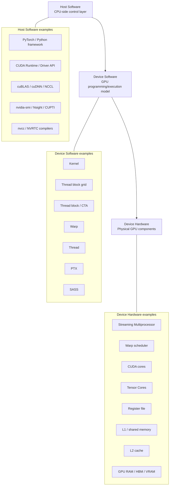

### Host Software: CPU-Side Control Layer

The host is the CPU side. This is where Python, PyTorch, CUDA runtime calls, compilers, drivers, and profiling tools live.

Useful Modal pages:

| Term | Link | Why It Matters |
| --- | --- | --- |
| CUDA software platform | https://modal.com/gpu-glossary/host-software/cuda-software-platform | Overall NVIDIA GPU software ecosystem. |
| CUDA C++ | https://modal.com/gpu-glossary/host-software/cuda-c | Shows `__global__` kernels, `<<<>>>` launch syntax, shared memory, `threadIdx`, `blockDim`. |
| CUDA Runtime API | https://modal.com/gpu-glossary/host-software/cuda-runtime-api | CPU-side API for launching kernels and managing memory. |
| CUDA Driver API | https://modal.com/gpu-glossary/host-software/cuda-driver-api | Lower-level interface underneath many CUDA runtime operations. |
| nvidia-smi | https://modal.com/gpu-glossary/host-software/nvidia-smi | Quick monitoring for GPU utilization/memory/processes. |
| Nsight Systems | https://modal.com/gpu-glossary/host-software/nsight-systems | Timeline profiling for CPU/GPU execution. |
| cuBLAS | https://modal.com/gpu-glossary/host-software/cublas | Optimized matrix multiplication library. |
| cuDNN | https://modal.com/gpu-glossary/host-software/cudnn | Optimized deep learning primitives. |
| CUTLASS | https://modal.com/gpu-glossary/host-software/cutlass | CUDA templates for high-performance GEMM/kernels. |

Host software is where your framework decides what to launch, but it is not where the GPU math is executed.

```text
Developer Python code
    -> PyTorch / Triton / framework
    -> CUDA runtime/libraries
    -> kernel launch
    -> GPU device software/hardware runs the work
```

### Device Software: GPU Programming Model

Device software is the logical model of what runs on the GPU. This includes kernels, grids, blocks, threads, warps, memory hierarchy, PTX, and SASS.

Useful Modal pages:

| Term | Link | Why It Matters |
| --- | --- | --- |
| CUDA programming model | https://modal.com/gpu-glossary/device-software/cuda-programming-model | The core model for GPU programs. |
| Thread | https://modal.com/gpu-glossary/device-software/thread | Lowest programming unit; has private registers. |
| Warp | https://modal.com/gpu-glossary/device-software/warp | Group of 32 threads scheduled together; typical execution unit. |
| Cooperative Thread Array / CTA | https://modal.com/gpu-glossary/device-software/cooperative-thread-array | Another name for a thread block. |
| Kernel | https://modal.com/gpu-glossary/device-software/kernel | A GPU function launched from host code. |
| Thread block | https://modal.com/gpu-glossary/device-software/thread-block | A group of threads that can cooperate via shared memory. |
| Thread block grid | https://modal.com/gpu-glossary/device-software/thread-block-grid | All blocks launched for one kernel. |
| Thread hierarchy | https://modal.com/gpu-glossary/device-software/thread-hierarchy | Relationship between grid, block, thread, and warp. |
| Memory hierarchy | https://modal.com/gpu-glossary/device-software/memory-hierarchy | How registers, shared memory, global memory relate. |
| Registers | https://modal.com/gpu-glossary/device-software/registers | Fast private thread storage. |
| Shared memory | https://modal.com/gpu-glossary/device-software/shared-memory | Fast block-local memory. |
| Global memory | https://modal.com/gpu-glossary/device-software/global-memory | Large GPU memory visible to all threads. |
| PTX | https://modal.com/gpu-glossary/device-software/parallel-thread-execution | NVIDIA intermediate representation. |
| SASS | https://modal.com/gpu-glossary/device-software/streaming-assembler | Low-level GPU machine instructions. |

The key relationship:

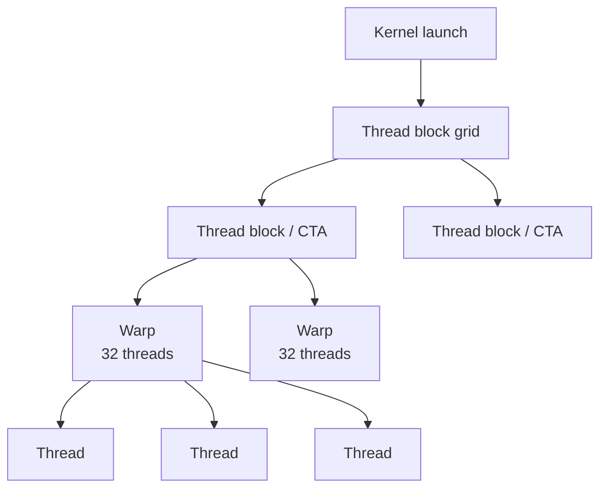

Modal's warp page is especially important: a warp is not something you explicitly create in the CUDA thread hierarchy, but it is how NVIDIA GPUs schedule execution. Threads in a warp normally execute the same instruction together. If threads in a warp take different branches, performance can drop due to warp divergence.

### Device Hardware: Physical GPU Components

Device hardware is the physical machinery that runs the device software.

Useful Modal pages:

| Term | Link | Why It Matters |
| --- | --- | --- |
| CUDA device architecture | https://modal.com/gpu-glossary/device-hardware/cuda-device-architecture | Overall NVIDIA GPU hardware architecture. |
| Streaming Multiprocessor / SM | https://modal.com/gpu-glossary/device-hardware/streaming-multiprocessor | Main hardware execution unit for blocks/warps. |
| Streaming Multiprocessor Architecture | https://modal.com/gpu-glossary/device-hardware/streaming-multiprocessor-architecture | Versioned SM architecture, such as Hopper SM90. |
| Warp scheduler | https://modal.com/gpu-glossary/device-hardware/warp-scheduler | Chooses eligible warps to issue instructions. |
| CUDA Core | https://modal.com/gpu-glossary/device-hardware/cuda-core | Executes normal scalar/vector arithmetic instructions. |
| Tensor Core | https://modal.com/gpu-glossary/device-hardware/tensor-core | Specialized matrix multiply-accumulate hardware. |
| Load/Store Unit | https://modal.com/gpu-glossary/device-hardware/load-store-unit | Handles memory load/store instructions. |
| Register File | https://modal.com/gpu-glossary/device-hardware/register-file | Physical storage backing thread registers. |
| L1 Data Cache | https://modal.com/gpu-glossary/device-hardware/l1-data-cache | Fast on-SM cache close to execution units. |
| GPU RAM | https://modal.com/gpu-glossary/device-hardware/gpu-ram | Large off-chip GPU memory, often HBM/VRAM. |
| Tensor Memory Accelerator / TMA | https://modal.com/gpu-glossary/device-hardware/tensor-memory-accelerator | Newer hardware for moving tensor tiles efficiently. |

Original study picture:

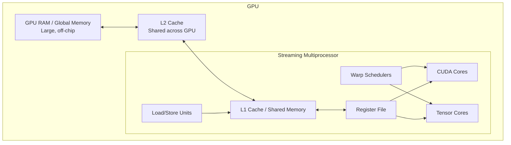

### How To Use Modal While Reading This Note

Use this note for a connected story. Use Modal as a glossary when a term feels fuzzy.

Suggested lookup flow:

```text
If you are confused by CPU/GPU control:
    read Modal Host Software + CUDA C++ pages.

If you are confused by kernel/block/thread/warp:
    read Modal Device Software pages.

If you are confused by SM/Tensor Core/cache/registers:
    read Modal Device Hardware pages.

If you are confused by performance terms:
    follow Modal links from warp, occupancy, latency hiding, and warp stalls.
```

The most important Modal insight for our purposes:

```text
GPU work spans multiple layers.
Host software launches and manages work.
Device software defines the logical execution model.
Device hardware actually schedules and executes the work.
```

## 1. What Is A GPU?

A CPU is optimized for low-latency, flexible, branchy work. A GPU is optimized for massive parallel throughput: doing the same kind of operation over many data elements at once.

Deep learning uses GPUs well because most expensive operations are large tensor operations, especially matrix multiplication. These have huge amounts of similar work that can be split over thousands of GPU threads.

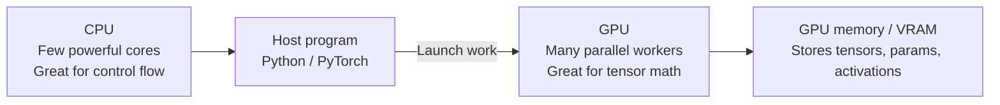

### CPU vs GPU

| Concept | CPU | GPU |
| --- | --- | --- |
| Core count | Fewer, more complex cores | Many simpler execution lanes grouped into SMs |
| Strength | Branching, OS work, small tasks, latency | Large parallel tensor workloads, throughput |
| Typical bottleneck | Often instruction/control or cache behavior | Often memory bandwidth or insufficient parallelism |
| Deep learning role | Data loading, orchestration, Python, launch kernels | Tensor ops, matmul, attention, training compute |

## 2. CUDA Vocabulary

CUDA is NVIDIA's platform/API for programming GPUs. PyTorch and Triton sit above CUDA, but CUDA vocabulary still appears everywhere.

| Term | Plain English Meaning |
| --- | --- |
| Host | CPU side. Your Python process runs here. |
| Device | GPU side. CUDA kernels execute here. |
| Kernel | A function launched onto the GPU. Many GPU threads run it in parallel. |
| Grid | The whole collection of thread blocks launched for one kernel. |
| Block | A group of GPU threads scheduled together on an SM. Threads in a block can share fast shared memory. |
| Thread | One logical lane of work inside a kernel. |
| Warp | A group of 32 threads scheduled together on NVIDIA GPUs. |
| SM | Streaming Multiprocessor. A major compute unit inside the GPU. Blocks are assigned to SMs. |
| Global memory | Large GPU memory/VRAM. Big but slow compared with on-chip memory. |
| Shared memory | Small, fast memory inside an SM, shared by threads in a block. |
| Register | Tiny, extremely fast storage private to a thread. |
| Tensor Core | Specialized hardware for fast matrix multiply/accumulate on low precision types. |

## 3. CUDA Execution Flow

The basic CUDA workflow is: CPU prepares data, data lives on GPU, CPU launches GPU kernels, GPU runs them asynchronously, and CPU/GPU synchronize only when needed.

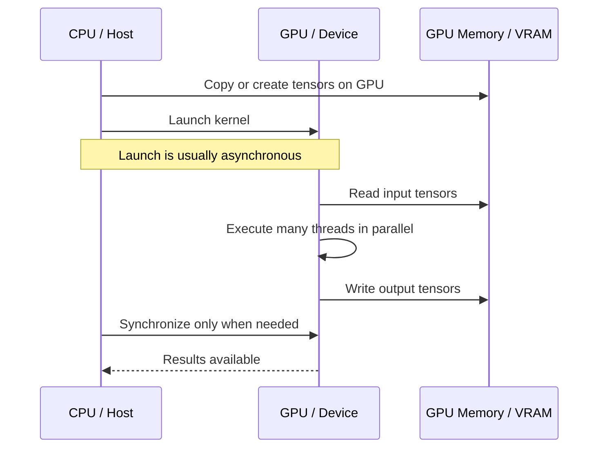

Important PyTorch implication: timing GPU code with normal wall-clock Python can be misleading unless you synchronize. Many PyTorch CUDA ops are queued and return control to Python before the GPU is done.

## 4. GPU Hardware Picture

A modern NVIDIA GPU has many SMs, each with schedulers, CUDA cores, Tensor Cores, registers, and shared memory. All SMs access large GPU memory through caches.

### GPU Software/Hardware Stack

When people say "the GPU framework", they often mean the full stack from your Python code down to the GPU hardware. A PyTorch operation does not directly talk to Tensor Cores. It travels through several software layers first.

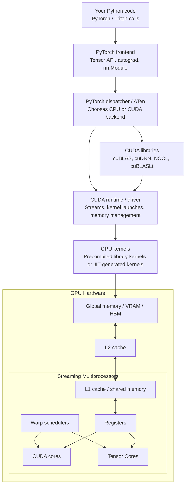

For normal PyTorch eager operations, many common operations call existing optimized kernels from CUDA libraries. For custom Triton code, Triton JIT-compiles a kernel and then launches it through the CUDA runtime/driver.

```text
Normal PyTorch matmul:
    Python -> PyTorch -> ATen -> cuBLAS/cuBLASLt -> CUDA runtime -> GPU kernel -> GPU hardware

Triton kernel:
    Python -> Triton JIT -> generated GPU kernel -> CUDA runtime -> GPU hardware

Distributed PyTorch:
    Python -> PyTorch distributed -> NCCL/Gloo backend -> network/GPU communication
```

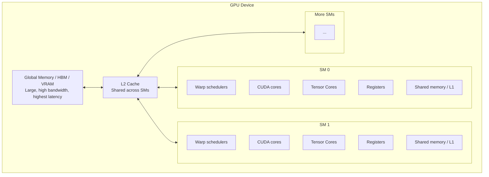

### Memory Hierarchy

The faster the memory, the smaller and closer it is.

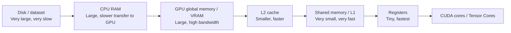

| Memory | Scope | Size | Speed | Why It Matters |
| --- | --- | --- | --- | --- |
| CPU RAM | Host | Large | Slow for GPU use | Data must often move to GPU. |
| Global memory / VRAM / HBM | Whole GPU | GBs | High bandwidth, high latency | Stores model weights, activations, optimizer states. |
| L2 cache | Whole GPU | MBs | Faster | Reuses recently accessed global memory. |
| Shared memory / L1 | One SM/block | KBs | Much faster | Used by optimized kernels to reuse tiles. |
| Registers | One thread | Tiny | Fastest | Used for immediate values and accumulators. |

## 5. Why Memory Movement Dominates

A GPU may have huge FLOPS, but those compute units need data. If data arrives slowly from global memory, compute units wait.

Horace He's key framing:

- Compute-bound: math is the bottleneck.
- Memory-bandwidth-bound: moving tensors is the bottleneck.
- Overhead-bound: CPU/Python/kernel-launch overhead is the bottleneck.

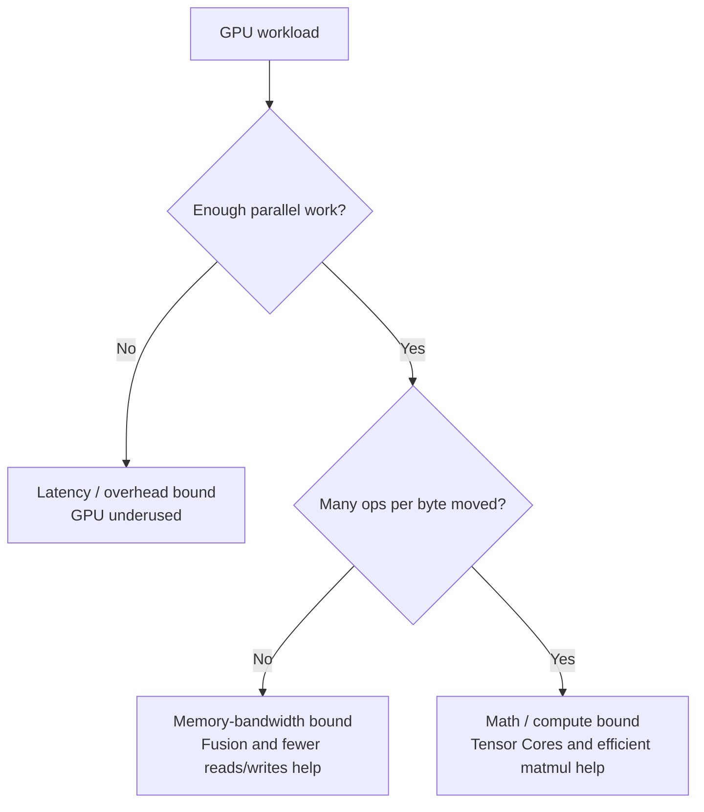

### Examples In Deep Learning

| Operation Type | Common Limit | Reason |
| --- | --- | --- |
| ReLU / elementwise add | Memory-bound | Few math ops per element loaded/stored. |
| LayerNorm / Softmax | Often memory/reduction-bound | Reads many values, reductions, moderate math. |
| Large matmul | Often compute-bound or near compute-bound | Many multiply-adds per byte moved. |
| Small matmul / batch size 1 linear | Often memory/latency-bound | Not enough work or reuse to saturate GPU. |
| Python loops over small tensors | Overhead-bound | Too many small kernel launches / Python overhead. |

## 6. Arithmetic Intensity

Arithmetic intensity is a simple performance lens:

```text
arithmetic intensity = number of math operations / number of bytes moved
```

High arithmetic intensity means each byte is reused for lots of computation. Low arithmetic intensity means the GPU mostly moves memory around.

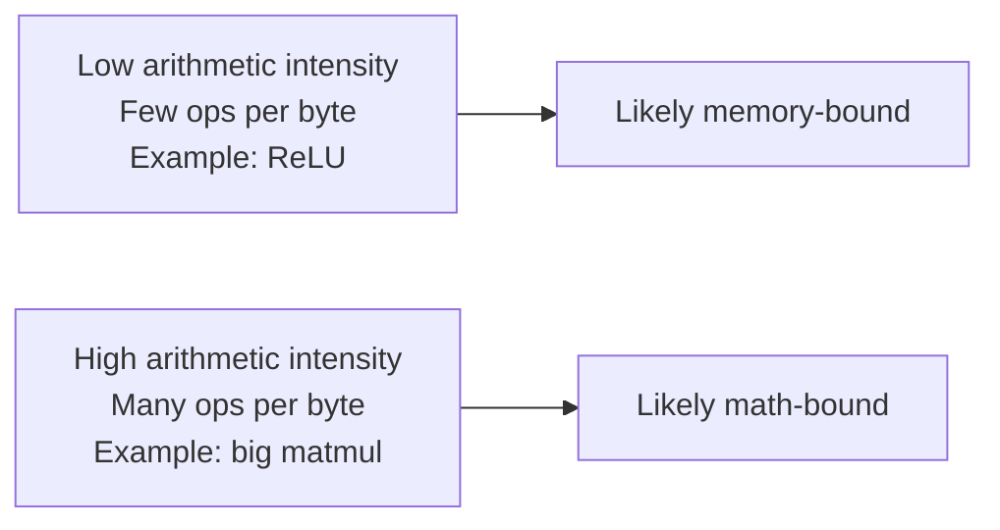

For matrix multiplication `C = A @ B`, each output element is a dot product. The same elements of `A` and `B` can be reused many times if the kernel tiles the computation well. This is why matmul is the central operation that GPUs are built to run fast.

## 7. Operator Fusion

If PyTorch runs separate kernels for separate elementwise operations, each kernel may read from global memory and write back to global memory.

Unfused:


Fused:


Fusion helps because it avoids unnecessary round trips through global memory. This is one reason Triton kernels can be useful: you can fuse multiple logical steps into one GPU kernel.

## 8. Matrix Multiplication And Tiling

Naive matmul reads too much from global memory. Fast matmul uses tiling:

1. Load a tile of `A` and a tile of `B` from global memory.
2. Store them in shared memory or registers.
3. Do many multiply-add operations using those tiles.
4. Repeat over the inner dimension.
5. Write the output tile.

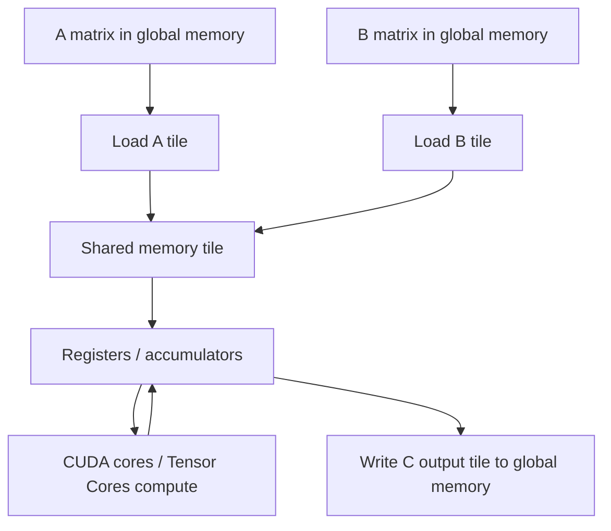

### Why Tiling Helps

Without tiling, the same data may be loaded from global memory repeatedly. With tiling, data is loaded once into fast memory and reused many times.

```text
Bad pattern:  load A/B from global memory, do tiny work, repeat
Good pattern: load A/B tile once, do lots of work, then write result
```

This idea is the bridge to both Triton matmul and FlashAttention.

## 9. Tensor Cores

Tensor Cores are specialized units for matrix multiply-accumulate. They are especially important for FP16, BF16, TF32, FP8, and INT8 workloads.

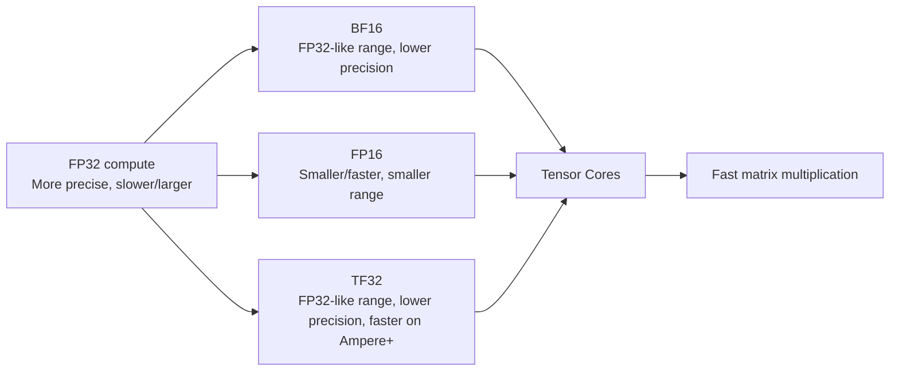

Why this matters for Assignment 2:

- Mixed precision saves memory and bandwidth.
- Tensor Cores make low-precision matmul fast.
- Some values still need higher precision for stability, like master weights or reductions.

## 9.1. Real Example: One Matrix Multiply On The GPU

Consider a tiny matrix multiply:

```text
A has shape [2, 3]
B has shape [3, 2]
C = A @ B has shape [2, 2]

A = [a00 a01 a02]
    [a10 a11 a12]

B = [b00 b01]
    [b10 b11]
    [b20 b21]

C = [c00 c01]
    [c10 c11]

c00 = a00*b00 + a01*b10 + a02*b20
c01 = a00*b01 + a01*b11 + a02*b21
c10 = a10*b00 + a11*b10 + a12*b20
c11 = a10*b01 + a11*b11 + a12*b21
```

This tiny example is too small to use a GPU efficiently, but it shows the same idea as a large deep learning matrix multiply. Each output value is a dot product. A real model might multiply matrices with thousands of rows and columns, producing millions of output values. That is where the GPU has enough parallel work to shine.

### Python To GPU Flow

When you ask PyTorch to multiply two CUDA tensors, Python does not itself multiply the numbers. Python calls into PyTorch's C++ backend. PyTorch then dispatches to a CUDA backend, often an optimized NVIDIA library such as cuBLAS or cuBLASLt for matrix multiplication. Those libraries launch GPU kernels.

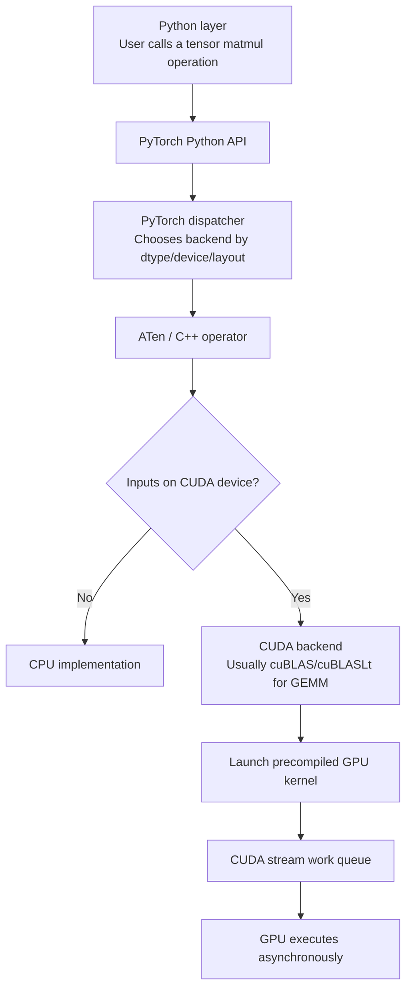

Important nuance: ordinary PyTorch eager-mode matmul usually does not compile your Python into GPU code. It calls prebuilt optimized kernels. In contrast, `torch.compile`, TorchInductor, and Triton can generate and compile specialized kernels for some workloads.

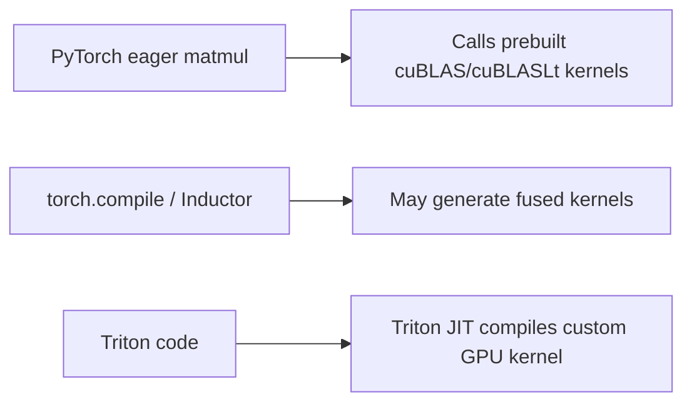

### GPU Execution Flow For A Large Matmul

For a real large matrix multiply, the output matrix `C` is split into tiles. Each tile is assigned to a GPU thread block. Blocks are scheduled onto SMs. Threads inside a block are grouped into warps. Warps execute instructions and cooperate through shared memory/registers.

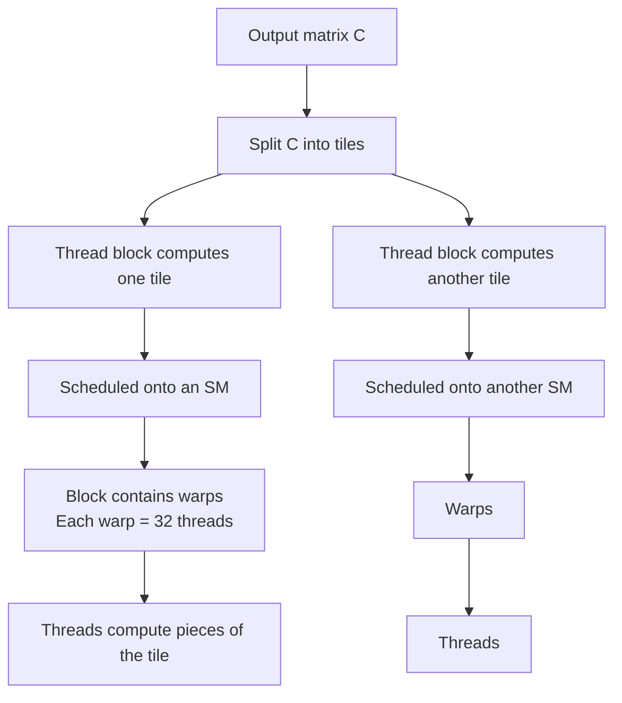

The mapping is roughly:

| Level | What It Does In Matmul |
| --- | --- |
| Whole kernel launch | Computes the full matrix multiply. |
| Grid | All thread blocks for all output tiles. |
| Thread block | Computes one tile or part of a tile of output `C`. |
| SM | Hardware unit that runs one or more thread blocks. |
| Warp | 32 threads scheduled together inside an SM. |
| Thread | Computes small pieces of the output or participates in loading tiles. |
| Register | Holds per-thread temporary values and accumulators. |
| Shared memory / L1 | Holds tiles of `A` and `B` reused by threads in the block. |
| L2 cache | Caches global memory data shared across SMs. |
| Global memory / VRAM | Stores full `A`, `B`, and `C` tensors. |

### Memory Flow Inside One Output Tile

The GPU tries to avoid repeatedly reading the same values from slow global memory. A fast matmul kernel moves data down the memory hierarchy, uses it many times, and only writes the final result back.

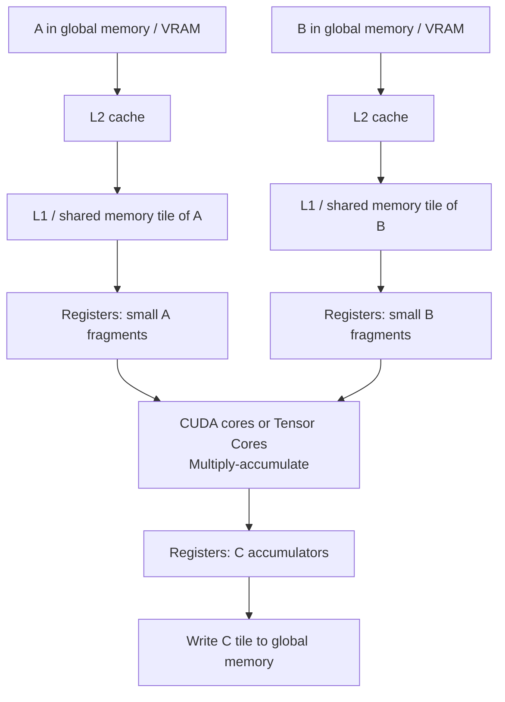

Think of the hierarchy like this:

```text
Global memory: stores all of A, B, C. Large but expensive to access.
L2 cache: catches recently used global-memory data for all SMs.
L1/shared memory: per-SM fast workspace for tiles.
Registers: per-thread tiny workspace for values and accumulators.
Tensor Cores/CUDA cores: do the actual math.
```

### What Threads And Warps Do

Inside a block, not every thread independently computes a whole dot product from global memory. That would waste bandwidth. Instead, groups of threads cooperate:

1. Some instructions load a tile of `A` and `B` from global memory through L2 into shared memory.
2. Threads synchronize so the tile is ready.
3. Warps load small fragments from shared memory into registers.
4. CUDA cores or Tensor Cores perform multiply-accumulate operations.
5. The block repeats this over the inner dimension of the matmul.
6. The final accumulated output tile is written to global memory.

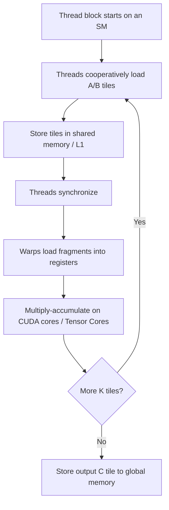

### A Tiny Matrix vs A Real GPU Matrix

The tiny `[2, 3] @ [3, 2]` example has only four output values, so a GPU would be mostly idle. A real neural network matmul has many more output elements and a long inner dimension.

```text
Tiny example:
  A [2, 3] @ B [3, 2] -> C [2, 2]
  Only 4 output elements. Bad GPU utilization.

Real deep learning example:
  A [4096, 4096] @ B [4096, 4096] -> C [4096, 4096]
  Over 16 million output elements.
  Each output has a 4096-element dot product.
  Huge parallel work and data reuse.
```

### Where Compilation Fits

There are several paths, and it helps not to mix them up:

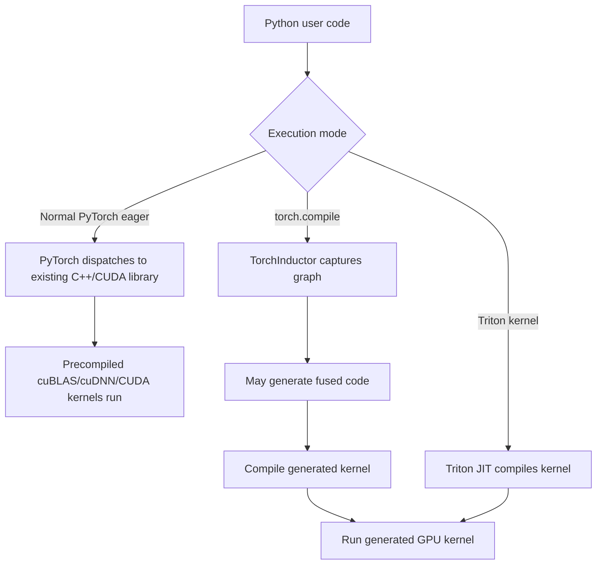

For Assignment 2, Triton matters because you will reason closer to the kernel level: program IDs, blocks/tiles, masks, loads/stores, and avoiding expensive global-memory traffic.

### Why This Matters For FlashAttention

FlashAttention applies the same memory lesson to attention:

```text
Matmul lesson:
  Do not repeatedly move large matrices through global memory.
  Tile data, keep it close to compute, reuse it.

FlashAttention lesson:
  Do not write the huge attention matrix to global memory.
  Tile Q/K/V, keep temporary scores close to compute, maintain online softmax stats.
```

## 10. FlashAttention Intuition

Standard attention computes an attention score matrix roughly shaped `[seq_len, seq_len]`. For long sequences, that matrix is huge. FlashAttention avoids materializing the full matrix in global memory.

Standard attention memory flow:

```mermaid
flowchart LR
    Q[Q] --> Scores[Compute full QK^T scores]
    K[K] --> Scores
    Scores --> Mem[Store/read huge attention matrix]
    Mem --> Softmax[Softmax]
    Softmax --> P[Attention probabilities]
    P --> Out[Multiply by V]
    V[V] --> Out
```

FlashAttention-style idea:

```mermaid
flowchart TD
    Q[Q block] --> TileLoop[Loop over K/V blocks]
    K[K block] --> TileLoop
    V[V block] --> TileLoop
    TileLoop --> Online[Online softmax bookkeeping\nmax + log-sum-exp]
    Online --> Acc[Accumulate output block]
    Acc --> Out[Write final output only]
```

Core intuition:

- Do attention in blocks.
- Keep temporary scores in fast memory.
- Maintain numerically stable softmax statistics online.
- Avoid writing the full attention matrix to global memory.
- Recompute some values in backward if that saves memory overall.

## 11. PyTorch GPU Model

PyTorch hides most CUDA details, but the same principles apply.

```mermaid
flowchart TD
    Python[Python code] --> Tensor[Torch tensor]
    Tensor --> Device{Tensor device?}
    Device -- cpu --> CPUOps[CPU kernel]
    Device -- cuda --> CUDAOps[CUDA kernel launch]
    CUDAOps --> Queue[GPU work queue]
    Queue --> GPUExec[GPU executes asynchronously]
    GPUExec --> Result[Result tensor on GPU]
    Result --> Sync{Need CPU value?}
    Sync -- .item / print / cpu --> Wait[CPU waits for GPU]
    Sync -- no --> Continue[CPU continues launching work]
```

Common performance traps:

- Calling `.item()` inside a loop can force synchronization.
- Printing CUDA tensors can force synchronization.
- Many tiny tensor operations can become overhead-bound.
- Creating tensors on CPU then copying to GPU is slower than creating directly on GPU when possible.
- DataLoader pinned memory helps CPU-to-GPU transfer.

## 12. Distributed Training Preview

Distributed training adds communication between processes/GPUs.

DDP idea:

```mermaid
flowchart LR
    R0[Rank 0\nfull model] <-- all-reduce gradients --> R1[Rank 1\nfull model]
    R1 <-- all-reduce gradients --> R2[Rank 2\nfull model]
    R2 <-- all-reduce gradients --> R0
```

FSDP idea:

```mermaid
flowchart TD
    Shard[Each rank stores parameter shard] --> Gather[All-gather full param before compute]
    Gather --> ForwardBackward[Forward/backward compute]
    ForwardBackward --> ReduceScatter[Reduce-scatter gradients]
    ReduceScatter --> Update[Optimizer updates local shard]
```

Memory intuition:

- DDP replicates the whole model on every rank.
- FSDP shards parameters, gradients, and often optimizer states.
- Sharding reduces memory but increases communication and coordination.

## 13. How This Maps To Assignment 2

| Assignment Topic | Background You Need |
| --- | --- |
| Triton kernels | CUDA execution model, blocks, program IDs, masks, memory hierarchy. |
| FlashAttention | Tiling, global memory vs shared/registers, online softmax, recomputation tradeoffs. |
| DDP | Rank/world size, process groups, all-reduce, autograd hooks, async communication. |
| FSDP | All-gather, reduce-scatter, parameter sharding, mixed precision. |
| Sharded optimizer | Optimizer states dominate memory; shard states across ranks. |

## 14. Self-Check Questions

Before going deeper, try answering these without looking:

1. Why is a GPU faster than a CPU for large matrix multiplication?
2. Why can a GPU be slow for many tiny operations?
3. What is the difference between global memory and shared memory?
4. What is a warp?
5. Why does operator fusion help memory-bound operations?
6. What does arithmetic intensity measure?
7. Why do Tensor Cores matter for deep learning?
8. Why does FlashAttention avoid storing the full attention matrix?
9. Why does DDP need all-reduce?
10. Why does FSDP need all-gather and reduce-scatter?

## 15. Suggested Reading Flow

```mermaid
flowchart TD
    B[NVIDIA GPU Performance Background\nCore model] --> C[Modal GPU Glossary\nLookup terms]
    C --> D[Horace He\nCompute vs memory vs overhead]
    D --> E[Tim Dettmers\nTensor Cores and bandwidth]
    E --> F[NVIDIA Matmul Background\nTiling and arithmetic intensity]
    F --> G[CS336 Lectures\nCourse-specific framing]
    G --> H[Triton Tutorials\nVector add, softmax, matmul]
    H --> I[FlashAttention papers/docs\nIO-aware attention]
    I --> J[PyTorch Distributed Docs\nDDP/FSDP]
```

## Q&A

### Q1. What is the relationship between tensor operations and matrix multiplication?

A tensor is a multi-dimensional array. A scalar is a 0D tensor, a vector is a 1D tensor, a matrix is a 2D tensor, and higher-dimensional arrays like `[batch, sequence, hidden_dim]` are also tensors.

Matrix multiplication is one important kind of tensor operation, but tensor operations include much more:

```text
Tensor operation
├── Elementwise operations
│   ├── add
│   ├── multiply
│   ├── ReLU
│   └── GELU
├── Reductions
│   ├── sum
│   ├── mean
│   ├── max
│   └── variance
├── Shape and layout operations
│   ├── reshape
│   ├── transpose
│   ├── view
│   ├── permute
│   └── concatenate
├── Indexing and masking
│   ├── slicing
│   ├── gather
│   ├── scatter
│   └── causal mask
├── Matrix-like operations
│   ├── matrix multiplication
│   ├── batched matrix multiplication
│   ├── einsum
│   └── tensor contraction
├── Neural-network operations
│   ├── convolution
│   ├── softmax
│   ├── layer norm
│   ├── RMSNorm
│   └── attention
└── Distributed tensor operations
        ├── all-reduce
        ├── all-gather
        ├── reduce-scatter
        └── sharding
```

Matrix multiplication is a tensor contraction: it multiplies along a shared dimension and sums over that dimension.

```text
A shape: [m, k]
B shape: [k, n]
C = A @ B
C shape: [m, n]

C[i, j] = sum over k of A[i, k] * B[k, j]
```

Many deep learning layers are built from matrix multiplication:

```text
Linear layer:
    y = x W

Transformer Q/K/V projection:
    Q = X Wq
    K = X Wk
    V = X Wv

Attention scores:
    scores = Q K^T

Attention output:
    output = softmax(scores) V

MLP block:
    hidden = X W1
    output = hidden W2
```

Not all tensor operations are matrix multiplication. For example, ReLU applies a simple function to each element, softmax exponentiates and normalizes values, LayerNorm computes statistics and normalizes, and reshape changes how tensor memory is interpreted.

A useful mental model:

```text
Tensor operation = any operation on tensors.
Matrix multiplication = one very important tensor operation.
Deep learning = many tensor operations, with matmul usually dominating FLOPs.
GPU optimization = often about making non-matmul tensor ops cheaper and keeping matmul fast.
```

### Q2. Does the CPU control the GPU workload?

Mostly yes. The CPU is the host/controller. The GPU is the device/accelerator. The CPU runs your Python program, decides which library calls happen next, launches GPU kernels, manages memory copies or tensor placement, and reads results back when the program asks for them.

However, the CPU usually does not manually assign individual GPU threads. It launches a GPU kernel with a grid/block configuration, and the GPU hardware schedules blocks, warps, and threads onto SMs.

The normal flow looks like this:

```mermaid
sequenceDiagram
        participant CPU as CPU / Host
        participant Runtime as CUDA Runtime / Driver
        participant Queue as CUDA Stream Queue
        participant GPU as GPU / Device
        participant VRAM as GPU Memory / VRAM

        CPU->>CPU: Run Python/PyTorch code
        CPU->>Runtime: Request tensor operation
        Runtime->>VRAM: Ensure inputs are on GPU memory
        CPU->>Runtime: Launch GPU kernel
        Runtime->>Queue: Enqueue kernel work
        Queue->>GPU: GPU schedules blocks onto SMs
        GPU->>VRAM: Read input tensors
        GPU->>GPU: Execute blocks, warps, threads
        GPU->>VRAM: Write output tensors
        CPU->>Runtime: Continue without waiting if possible
        CPU->>Runtime: Synchronize if result is needed on CPU
        Runtime->>CPU: Return result or completion
```

So the CPU controls the high-level workload order:

```text
CPU decides:
    - which PyTorch/Triton/CUDA operation is called
    - when a GPU kernel is launched
    - which input tensors are passed
    - when to copy data CPU -> GPU or GPU -> CPU
    - when to wait for GPU results

GPU decides/schedules:
    - which SM runs each thread block
    - which warps are ready to execute
    - how memory requests flow through caches
    - when each queued kernel actually finishes
```

In PyTorch, this is often asynchronous. The CPU can launch GPU work and then keep going while the GPU is still computing. The CPU only waits when there is a synchronization point.

Common synchronization points include:

```text
tensor.cpu()
tensor.item()
print(cuda_tensor)
torch.cuda.synchronize()
some timing/profiling calls
some distributed communication barriers
```

A useful metaphor:

```text
CPU = project manager and dispatcher
GPU = giant workshop full of parallel workers
CUDA stream = work queue
Kernel = one job ticket sent to the workshop
VRAM = warehouse next to the workshop
Synchronization = project manager waits until the workshop finishes
```

This is why too many tiny GPU tasks can be slow. The CPU spends time launching lots of small kernels, and the GPU may not get enough work per launch to stay busy.

### Q3. Does the CPU control every GPU kernel and know which SM is busy? Is a kernel the same thing as an SM?

No. A kernel is not an SM.

A GPU kernel is a function/program that runs on the GPU. When the CPU launches a kernel, it is saying something like: "GPU, run this function over this many blocks and threads, using these input/output tensors."

An SM, or Streaming Multiprocessor, is hardware inside the GPU. SMs are the places where thread blocks actually execute.

```text
Kernel = the GPU program/function being launched.
Grid = all thread blocks created for one kernel launch.
Block = a group of threads from that kernel.
Warp = 32 threads from a block, scheduled together.
SM = hardware unit that runs blocks/warps.
```

The relationship looks like this:

```mermaid
flowchart TD
        CPU[CPU launches one kernel] --> Kernel[Kernel launch\nOne GPU function invocation]
        Kernel --> Grid[Grid\nMany thread blocks]
        Grid --> B0[Block 0]
        Grid --> B1[Block 1]
        Grid --> B2[Block 2]
        Grid --> BN[More blocks]
        B0 --> SM0[SM 0 hardware]
        B1 --> SM1[SM 1 hardware]
        B2 --> SM0
        BN --> SMN[Other SMs]
        SM0 --> W0[Warps execute]
        SM1 --> W1[Warps execute]
        SMN --> WN[Warps execute]
```

The CPU controls high-level work submission, not low-level SM scheduling.

```text
CPU controls:
    - which operation/kernel is launched
    - launch order in a CUDA stream
    - input/output tensor addresses and metadata
    - when to synchronize or wait

GPU hardware/driver controls:
    - which SM receives each block
    - which warp runs next on an SM
    - how memory requests move through L1/L2/global memory
    - when a block finishes and another block is scheduled
```

The CPU does not usually know, at every moment, "SM 17 is busy, SM 18 is idle, this warp is stalled on memory." That level of detail is handled by the GPU hardware and can be inspected only indirectly using profiling tools such as NVIDIA Nsight Systems or Nsight Compute.

The CPU can know coarser facts:

```text
The CPU can know:
    - this kernel has been launched
    - this CUDA stream has queued work
    - this event has completed
    - this synchronization point has finished
    - this operation failed or succeeded

The CPU usually does not directly know:
    - exactly which SM is running each block right now
    - exactly which warp is stalled
    - exactly how L1/L2 cache lines are being used
```

"Stall" means a warp is ready in principle but cannot make progress yet, often because it is waiting for memory, waiting for a dependency, or waiting for an execution pipeline. GPU profilers can report stall reasons, but ordinary Python/PyTorch code does not manage them directly.

A helpful analogy:

```text
CPU = office manager submitting jobs
Kernel = one job description
Grid = all work orders for that job
Block = one work crew
Warp = a subgroup of 32 workers moving together
SM = a workshop room where crews work
GPU scheduler = assigns crews to workshop rooms
Profiler = security camera that later tells you where time was spent
```

So when someone says "launch a kernel," they do not mean "launch an SM." They mean "launch a GPU program that creates many blocks/threads, which the GPU then schedules onto available SMs."

### Q4. What can we really control on the GPU from the CPU side?

From the CPU side, you control the high-level work you submit to the GPU and the data/resources you give it. You do not directly control the exact SM, warp scheduler, cache line, or cycle-by-cycle execution.

Here is the practical control boundary:

| You Can Control From CPU/Python | You Usually Cannot Directly Control |
| --- | --- |
| Which operation to run | Which exact SM runs a block |
| Input tensor shapes | Which exact warp runs next |
| Tensor dtype, such as fp32/fp16/bf16 | Exact L1/L2 cache replacement decisions |
| Tensor device, such as CPU vs CUDA | Exact memory transaction timing |
| Tensor layout/contiguity/strides | Exact instruction issue order inside the SM |
| Batch size and sequence length | Exact stall/resume timing for each warp |
| Whether to use PyTorch, `torch.compile`, Triton, cuBLAS, etc. | Physical placement of individual values in cache |
| CUDA stream ordering | All low-level hardware scheduling details |
| When to synchronize/wait | Full manual scheduling of all GPU workers |
| Kernel launch configuration in custom CUDA/Triton | Hardware warp scheduling policy |
| Environment/backend knobs | Internal library kernel choice details, unless exposed |

For ordinary PyTorch code, you usually control:

```text
1. What operation to call
    Example: matmul, softmax, layer norm, attention, all-reduce

2. Where tensors live
    CPU tensor or CUDA tensor

3. Tensor shapes
    Batch size, sequence length, hidden size, head dimension

4. Tensor dtype
    fp32, tf32, fp16, bf16, etc.

5. Tensor layout
    contiguous vs non-contiguous, transpose/permute/view choices

6. Execution mode
    eager PyTorch, torch.compile, Triton custom kernel, library call

7. Synchronization points
    whether you force CPU to wait for GPU results
```

For custom CUDA or Triton kernels, you control more:

```text
1. Grid size
    How many programs/thread blocks are launched.

2. Block/tile size
    How much data each block/program handles.

3. Memory access pattern
    Which elements each program loads/stores.

4. Shared memory use
    Whether tiles are staged in fast on-chip memory.

5. Masking and boundary handling
    How out-of-bounds work is avoided.

6. Dtype and accumulation choices
    For example, fp16 inputs with fp32 accumulation.

7. Fusion decisions
    Whether multiple logical operations happen in one kernel.
```

But even in custom kernels, the GPU still decides the lowest-level scheduling:

```text
You choose: launch 4096 blocks.
GPU chooses: which SM gets each block and when.

You choose: each block has certain work.
GPU chooses: which warp is issued next on that SM.

You choose: load these addresses.
GPU/cache hardware decides: cache hit/miss behavior and memory transaction details.
```

The most important practical controls for performance are usually:

```text
Tensor shape
Tensor dtype
Tensor layout/contiguity
Batch size / sequence length
Avoiding unnecessary CPU-GPU synchronization
Reducing tiny kernel launches
Using fused kernels where helpful
Using memory-efficient algorithms
Using the right distributed collective pattern
```

For Assignment 2, the most relevant controls are:

```text
FlashAttention/Triton:
  - tile/block sizes
  - what gets loaded from global memory
  - what stays in registers/shared memory
  - what gets written back
  - causal mask behavior
  - numerical stability bookkeeping

DDP:
  - when gradients are synchronized
  - what communication primitive is used
  - when to wait before optimizer.step()

FSDP:
  - what parameters are sharded
  - when full parameters are gathered
  - when gradients are reduce-scattered
  - what dtype is used for compute vs master weights
```

Simple mental model:

```text
CPU/Python controls the recipe and submits jobs.
CUDA/runtime/library prepares and queues jobs.
GPU hardware schedules the workers and runs the jobs.
Profiler tells you what actually happened.
```

#### More Breakdown: What PyTorch Controls vs What You Control

When you use PyTorch, there are three different "controllers" involved:

```text
1. You, the developer
2. PyTorch / framework internals
3. CUDA runtime, CUDA libraries, and GPU hardware
```

They control different layers of the stack.

```mermaid
flowchart TD
        Dev[Developer using PyTorch\nModel code, tensor shapes, dtype, device] --> PT[PyTorch framework\nAutograd, dispatcher, operator selection]
        PT --> Backend[CUDA backend / libraries\ncuBLAS, cuDNN, NCCL, custom kernels]
        Backend --> Runtime[CUDA runtime / driver\nStreams, memory allocator, kernel queue]
        Runtime --> HW[GPU hardware\nSMs, warps, caches, Tensor Cores]
```

##### What You Control As The PyTorch Developer

You mostly control the mathematical workload and the data layout. These choices strongly affect which GPU kernels PyTorch launches and how efficient they can be.

| What You Control | Example Decision | Why It Matters |
| --- | --- | --- |
| Operation choice | matmul vs loop of small ops | Determines which kernels get launched. |
| Tensor device | CPU tensor vs CUDA tensor | Determines whether operation runs on CPU or GPU. |
| Tensor dtype | fp32, fp16, bf16 | Affects memory usage, Tensor Core use, and numerical stability. |
| Tensor shape | batch size, sequence length, hidden size | Determines amount of parallel work and memory use. |
| Tensor layout | contiguous, transposed, strided | Affects whether kernels can access memory efficiently. |
| Model architecture | number of layers, heads, dimensions | Determines total compute and activation memory. |
| Batch size | small vs large batch | Affects GPU utilization and memory pressure. |
| Autograd usage | training vs no-grad inference | Determines whether activations/gradients must be stored. |
| Synchronization behavior | using `.item()`, `.cpu()`, printing tensors | Can force CPU to wait for GPU. |
| Execution mode | eager, `torch.compile`, custom Triton | Affects whether operations can be fused/compiled. |
| Distributed strategy | single GPU, DDP, FSDP | Controls memory/communication pattern. |

As a PyTorch user, you do not usually write the actual GPU kernel for `matmul`, `softmax`, or `conv`. You choose operations and tensor properties, and PyTorch chooses or generates kernels.

##### What PyTorch Controls Internally

PyTorch sits between your Python code and CUDA. It decides how to translate tensor operations into backend calls.

```text
PyTorch controls:
    - tracking tensor metadata: shape, dtype, device, strides
    - dispatching each operation to CPU or CUDA backend
    - building the autograd graph during training
    - saving tensors needed for backward
    - calling CUDA libraries such as cuBLAS/cuDNN/NCCL
    - launching CUDA kernels for many operations
    - using a caching allocator for GPU memory
    - queuing GPU work on CUDA streams
    - sometimes selecting optimized kernel variants
```

Example flow for a PyTorch matrix multiply:

```mermaid
sequenceDiagram
        participant User as Developer Code
        participant PT as PyTorch
        participant Lib as CUDA Library
        participant CUDA as CUDA Runtime
        participant GPU as GPU Hardware

        User->>PT: Request tensor matmul
        PT->>PT: Inspect device, dtype, shape, strides
        PT->>Lib: Choose CUDA matmul backend if tensors are on GPU
        Lib->>CUDA: Prepare kernel launch
        CUDA->>GPU: Enqueue kernel on CUDA stream
        GPU->>GPU: Schedule blocks/warps on SMs
        GPU-->>PT: Work completes later, often asynchronously
```

##### What CUDA Libraries Control

For common operations, PyTorch often delegates to specialized libraries:

| Library | Typical Role |
| --- | --- |
| cuBLAS / cuBLASLt | Matrix multiplication and linear algebra. |
| cuDNN | Convolutions, normalization, some activation/deep learning kernels. |
| NCCL | Multi-GPU communication such as all-reduce/all-gather/reduce-scatter. |
| CUDA runtime/driver | Memory management, streams, kernel launches, device interaction. |

These libraries may choose among many internal kernels. For example, cuBLAS may choose a different matmul kernel depending on matrix shape, dtype, transpose/layout, and hardware.

As a PyTorch developer, you influence this indirectly through shapes, dtype, layout, and backend settings. You usually do not directly choose the exact cuBLAS kernel implementation.

##### What The GPU Hardware Controls

Once a kernel is launched, GPU hardware controls the low-level execution.

```text
GPU hardware controls:
    - assigning thread blocks to SMs
    - scheduling warps on each SM
    - issuing instructions to CUDA cores / Tensor Cores
    - serving memory loads through L1/L2/global memory
    - cache hit/miss behavior
    - warp stalls and resume timing
```

This is why you can write a high-level PyTorch program and still need a profiler to understand performance. The profiler observes what actually happened below the Python level.

##### Concrete Example: Same Math, Different Control Choices

Suppose the mathematical goal is a linear layer. As a developer, you can express it in different ways.

Good high-level expression:

```text
One large matrix multiply
```

Likely result:

```text
PyTorch -> cuBLAS/cuBLASLt -> optimized GPU matmul kernel -> good GPU utilization
```

Poor expression:

```text
Many tiny operations in a Python loop
```

Likely result:

```text
Many small kernel launches -> CPU overhead + poor GPU utilization
```

The math might be equivalent, but the GPU workload is very different.

##### Practical Rule

You usually control performance by shaping the workload, not by micromanaging the hardware.

```text
You control:
    - big vs tiny operations
    - dtype
    - tensor layout
    - batch/sequence sizes
    - whether data stays on GPU
    - whether you force synchronization
    - whether you use fused/compiled/custom kernels

PyTorch controls:
    - dispatch
    - autograd
    - memory allocation cache
    - backend/library calls
    - many kernel launches

CUDA/GPU controls:
    - hardware scheduling
    - SM/warp execution
    - cache behavior
    - memory transaction details
```

So the best beginner mindset is:

```text
Do not ask: "How do I choose which SM runs my work?"
Ask instead: "Did I give the GPU a large, regular, reusable tensor workload with efficient dtype/layout and minimal synchronization?"
```

### Q5. What does GPU optimization really mean from the developer side?

From the developer side, GPU optimization means shaping your program so the GPU receives work it can execute efficiently. You are usually not telling the GPU exactly which SM or warp to use. Instead, you change the workload so the GPU hardware and CUDA libraries can make good use of the machine.

The main goal is:

```text
Keep GPU compute units busy.
Move less data through slow memory.
Reuse data once it is close to the compute units.
Launch fewer tiny kernels.
Avoid making the CPU wait unnecessarily.
Use the right dtype/layout/parallelism strategy.
```

Think of optimization as improving the "shape" of the work:

```mermaid
flowchart LR
        Bad[Poor GPU workload\nTiny ops, bad layout, many syncs, extra memory traffic]
        Dev[Developer changes\nshape, dtype, layout, fusion, batching, algorithm]
        Good[Better GPU workload\nLarge regular ops, less memory traffic, more reuse]
        Bad --> Dev --> Good
```

#### 1. Make Operations Large Enough

GPUs like large, regular, parallel work. A single large matrix multiply is usually much better than many tiny operations in a Python loop.

```text
Bad developer pattern:
    many tiny tensor ops from Python
    -> many kernel launches
    -> CPU overhead
    -> GPU often underused

Better pattern:
    one large batched tensor op
    -> fewer launches
    -> more work per launch
    -> better GPU utilization
```

This is why batching matters. Larger batches often give the GPU more parallel work, though they also use more memory.

#### 2. Reduce CPU-GPU Synchronization

GPU work is often asynchronous. If you force the CPU to read a GPU result too often, the CPU must wait for the GPU to finish.

Common accidental synchronization points:

```text
tensor.item()
tensor.cpu()
print(cuda_tensor)
torch.cuda.synchronize()
some timing/profiling code
some distributed barriers
```

Optimization means avoiding these inside hot loops unless you truly need them.

```text
Bad:
    every training step asks CPU for a scalar from GPU

Better:
    keep values on GPU and only sync occasionally for logging/checkpointing
```

#### 3. Use Efficient Dtypes

Dtype controls both speed and memory. Lower precision can reduce memory traffic and unlock Tensor Cores.

```text
fp32:
    more precise, bigger, slower for many deep learning workloads

tf32:
    often used automatically for fp32 matmul on NVIDIA Ampere+

fp16 / bf16:
    smaller, faster, Tensor-Core friendly
    often used for mixed precision training
```

Optimization from the developer side often means using mixed precision carefully:

```text
Use low precision where it is fast and stable.
Keep sensitive values, reductions, or master weights in higher precision when needed.
```

#### 4. Improve Tensor Layout And Contiguity

GPU kernels like predictable memory access. Non-contiguous tensors or awkward strides can force slower kernels or extra copies.

```text
Good memory access:
    neighboring threads read neighboring addresses
    -> coalesced memory access
    -> better bandwidth

Bad memory access:
    neighboring threads read scattered addresses
    -> inefficient memory transactions
    -> lower bandwidth
```

Developer-level control:

```text
Be aware when transpose/permute creates non-contiguous views.
Use contiguous layouts when kernels expect them.
Avoid unnecessary layout conversions in hot paths.
```

#### 5. Fuse Operations

Fusion means combining multiple logical operations into one GPU kernel. This reduces kernel launch overhead and avoids writing intermediate tensors to global memory.

```text
Unfused:
    read x -> op1 -> write tmp
    read tmp -> op2 -> write y

Fused:
    read x -> op1 + op2 -> write y
```

Developer tools for fusion include:

```text
torch.compile
Triton custom kernels
specialized library functions
fused optimizer/layer kernels
```

Fusion is especially useful for memory-bound operations like elementwise ops, normalization pieces, and softmax-like workflows.

#### 6. Choose Better Algorithms, Not Just Faster Code

Sometimes the biggest optimization is changing the algorithm so less data moves.

FlashAttention is a perfect example:

```text
Standard attention:
    materialize huge [seq_len, seq_len] attention matrix
    -> lots of global memory traffic

FlashAttention:
    process Q/K/V in tiles
    keep temporary scores close to compute
    write only final output
    -> much less global memory traffic
```

This is not merely "make code faster." It changes the memory behavior of the algorithm.

#### 7. Use The Right Distributed Strategy

In distributed training, optimization means choosing what gets replicated, sharded, communicated, and synchronized.

```text
DDP optimization questions:
    - when do gradients synchronize?
    - can communication overlap with backward compute?
    - are all ranks doing balanced work?

FSDP optimization questions:
    - what parameters are sharded?
    - when do we all-gather parameters?
    - when do we reduce-scatter gradients?
    - what dtype do we communicate/compute in?
```

The tradeoff is usually:

```text
More sharding -> less memory use, more communication complexity.
More replication -> simpler/faster local compute, more memory use.
```

#### 8. Measure With Profilers

Optimization without measurement is guessing. Since the CPU cannot directly see all low-level GPU behavior, profilers tell you what happened.

Useful things a profiler can reveal:

```text
GPU idle gaps
CPU launch overhead
kernel runtime
memory bandwidth
Tensor Core utilization
warp stalls
communication time
unexpected synchronization
```

Common tools:

```text
PyTorch profiler
NVIDIA Nsight Systems
NVIDIA Nsight Compute
```

#### Optimization Summary

From the developer side, optimization mostly means controlling these knobs:

| Knob | What You Are Trying To Improve |
| --- | --- |
| Batch/shape sizes | More parallel work, better GPU utilization. |
| Dtype | Less memory traffic, Tensor Core use. |
| Tensor layout | Better memory access patterns. |
| Fusion | Fewer kernel launches and less global memory traffic. |
| Algorithm | Less work or less memory movement. |
| Synchronization | Less CPU waiting. |
| Distributed strategy | Better memory/communication tradeoff. |
| Profiling | Know the actual bottleneck. |

The short version:

```text
GPU optimization from the developer side is not micromanaging SMs.
It is designing tensor work so the GPU scheduler, memory hierarchy, and libraries can do their job well.
```

### Q6. How do we monitor or deep-dive GPU performance in practice?

The practical workflow is usually top-down:

```text
1. Check whether the GPU is being used at all.
2. Measure step time and memory usage.
3. Use PyTorch profiler to see Python/PyTorch/operator-level behavior.
4. Use Nsight Systems to see CPU-GPU timeline and idle gaps.
5. Use Nsight Compute to inspect one important GPU kernel in detail.
6. Change one thing, measure again.
```

Do not start with the deepest tool. First identify what kind of bottleneck you have.

```mermaid
flowchart TD
        Start[Training or kernel feels slow] --> Basic[Check basic utilization and memory]
        Basic --> Q1{GPU mostly idle?}
        Q1 -- Yes --> CPU[Look for CPU overhead, data loading, sync, tiny kernels]
        Q1 -- No --> Q2{GPU busy but slow?}
        Q2 -- Yes --> Kernel[Profile kernels: memory-bound, compute-bound, bad layout]
        Q2 -- No --> Q3{Out of memory?}
        Q3 -- Yes --> Memory[Inspect activations, optimizer state, batch size, sharding]
        Q3 -- No --> Comm[If distributed: inspect communication and rank imbalance]
```

#### Level 0: Quick Health Checks

These tell you whether the GPU is active and whether memory is filling up.

Common tools:

```text
nvidia-smi
watch nvidia-smi
PyTorch memory APIs
training step time logs
```

What to look for:

| Signal | Possible Meaning |
| --- | --- |
| GPU utilization near 0% | Work may be on CPU, data loader bottleneck, or CPU waiting. |
| GPU utilization jumps up/down rapidly | Many short kernels or CPU launch/data overhead. |
| GPU memory almost full | Batch/model/activations/optimizer state too large. |
| Power draw low | GPU may not be doing heavy compute. |
| One GPU busier than others | Distributed imbalance or wrong device placement. |

Important caution: `nvidia-smi` is useful but coarse. It does not tell you which kernel is slow or why.

#### Level 1: PyTorch-Level Profiling

Use the PyTorch profiler when you want to know:

```text
Which PyTorch operators take time?
How much time is CPU-side vs CUDA-side?
Are there unexpected synchronizations?
Are there many tiny kernels?
Which ops allocate lots of memory?
```

PyTorch profiler is good because it speaks the same language as your code: `matmul`, `softmax`, `layer_norm`, `copy_`, `all_reduce`, and so on.

Typical questions:

```text
Is my training step dominated by dataloader time?
Is a CPU operation accidentally inside the hot path?
Are there many small CUDA kernels?
Is backward much slower than expected?
Do I see lots of CPU-GPU copies?
```

#### Level 2: Timeline Profiling With Nsight Systems

Nsight Systems is for timeline understanding. It shows CPU threads, CUDA kernel launches, GPU kernels, memory copies, and communication over time.

Use it when you ask:

```text
Is the GPU idle between kernels?
Is Python/CPU too slow to feed the GPU?
Are kernels launching one by one with gaps?
Are CPU-GPU copies blocking execution?
Do DDP/FSDP communication operations overlap with compute?
Are all ranks doing similar work?
```

The mental picture:

```mermaid
sequenceDiagram
        participant CPU as CPU timeline
        participant Stream as CUDA stream
        participant GPU as GPU timeline

        CPU->>Stream: launch kernel A
        Stream->>GPU: run kernel A
        CPU->>Stream: launch kernel B
        Stream->>GPU: run kernel B
        Note over GPU: Good case: GPU has little idle gap
```

Bad timeline pattern:

```text
CPU launch -> GPU runs tiny kernel -> idle gap -> CPU launch -> tiny kernel -> idle gap
```

Good timeline pattern:

```text
CPU queues work ahead -> GPU runs longer useful kernels with small gaps
```

#### Level 3: Kernel Deep Dive With Nsight Compute

Nsight Compute is for one kernel at a time. It answers hardware-level questions.

Use it when you already know which kernel matters and want to know why it is slow:

```text
Is this kernel memory-bound or compute-bound?
Is memory access coalesced?
Are Tensor Cores being used?
What is occupancy?
What are the warp stall reasons?
How much shared memory/register pressure is there?
What is achieved memory bandwidth?
What is achieved FLOP/s?
```

Common low-level metrics:

| Metric Idea | Meaning |
| --- | --- |
| Achieved occupancy | How many warps are active relative to hardware capacity. |
| SM utilization | Whether compute hardware is busy. |
| Memory throughput | How much global/shared memory bandwidth is used. |
| Warp stall reasons | Why warps wait: memory, dependencies, execution pipelines, etc. |
| Tensor Core utilization | Whether matrix units are being used well. |
| Register/shared memory usage | Whether resource pressure limits parallelism. |

#### Level 4: Distributed Profiling

For DDP/FSDP, single-GPU profiling is not enough. You also need to inspect communication and rank balance.

Look for:

```text
all_reduce time
all_gather time
reduce_scatter time
barrier/wait time
rank imbalance
communication overlapping with backward compute
one rank slower than others
```

Distributed performance often has this pattern:

```text
Fast ranks wait for slow ranks.
Slow communication exposes idle GPU gaps.
Poor overlap makes communication time visible.
Different batch shapes per rank create imbalance.
```

#### Common Bottleneck Patterns

| Symptom | Likely Cause | First Place To Look |
| --- | --- | --- |
| GPU utilization low | CPU/data loading/kernel launch overhead | PyTorch profiler, Nsight Systems |
| GPU memory full | activations, optimizer state, too large batch/model | PyTorch memory stats, model accounting |
| Many tiny CUDA kernels | unfused elementwise ops or Python loop | PyTorch profiler timeline |
| Matmul slower than expected | bad shape/dtype/layout, Tensor Cores not used | PyTorch profiler, Nsight Compute |
| Attention uses too much memory | full attention matrix materialized | memory profiling, algorithm review |
| DDP slow | gradient sync exposed, imbalance | distributed profiler/timeline |
| FSDP slow | too many all-gathers/reduce-scatters or poor overlap | Nsight Systems, rank logs |

#### Assignment 2 Profiling Mindset

For this assignment, think in layers:

```text
Correctness first:
    Are tensor shapes/dtypes/devices right?
    Are gradients numerically close to reference?
    Are ranks synchronized correctly?

Then performance:
    Is memory usage lower?
    Is communication overlapping with compute?
    Are kernels avoiding unnecessary global memory traffic?
    Are there unnecessary synchronizations?
```

Profiling is a loop:

```text
Observe -> Hypothesize -> Change one thing -> Measure -> Repeat
```

The short version:

```text
nvidia-smi tells you if something is happening.
PyTorch profiler tells you which framework-level ops matter.
Nsight Systems tells you the CPU/GPU timeline.
Nsight Compute tells you why one GPU kernel is slow.
Distributed profiling tells you which ranks/collectives are waiting.
```

### Q7. What does an LLM infrastructure role actually do, and why is there no single universal framework?

LLM infrastructure means making LLM training and inference run reliably, efficiently, and at scale.

That includes GPU systems, distributed training, serving, storage, scheduling, observability, reliability, and cost control. GPU performance is part of the role, but it is not the whole role.

There are common frameworks, but there is no single universal solution because LLM workloads differ a lot in model architecture, hardware, scale, training/inference goals, cost constraints, and reliability requirements.

Common tools do exist:

```text
Training/framework layer:
    PyTorch, JAX, TensorFlow

Distributed training:
    PyTorch DDP/FSDP, DeepSpeed, Megatron-LM, Colossal-AI, Accelerate

Inference serving:
    vLLM, TensorRT-LLM, SGLang, TGI, llama.cpp, FasterTransformer-style systems

Cluster/orchestration:
    Kubernetes, Slurm, Ray, SkyPilot, custom schedulers

Profiling/monitoring:
    PyTorch profiler, Nsight Systems, Nsight Compute, Prometheus/Grafana
```

But these tools are building blocks, not magic one-size-fits-all systems.

#### Main Areas Of LLM Infrastructure

| Area | What They Work On | Example Questions |
| --- | --- | --- |
| Training infrastructure | DDP, FSDP, tensor parallelism, pipeline parallelism, checkpointing, mixed precision, profiling | Why is GPU utilization low? Why is one rank waiting? How do we resume after node failure? |
| Inference / serving infrastructure | batching, KV cache, request scheduling, quantization, autoscaling, model serving APIs | How do we serve many users with low latency? How do we maximize tokens/sec? |
| GPU performance / kernels | FlashAttention, fused kernels, Triton/CUDA optimization, Tensor Core utilization | Can we avoid materializing this tensor? Is this kernel memory-bound? |
| Distributed systems / cluster infra | multi-node GPU jobs, NCCL, InfiniBand, NVLink, job scheduling, logging, metrics | How do we schedule 1024 GPUs? Why is network bandwidth low? |
| Data pipeline infrastructure | dataset storage, tokenization, shuffling, streaming, data versioning | Can training read tokens fast enough? Is data loading starving the GPU? |

#### Role Boundaries

In a small team, one person may work across all of these. In a large lab, they are often separate roles.

```text
LLM infra engineer:
    - training/inference systems
    - distributed execution
    - reliability
    - performance debugging
    - deployment

GPU kernel engineer:
    - CUDA/Triton kernels
    - FlashAttention-like optimization
    - fused ops
    - low-level profiling

ML framework engineer:
    - PyTorch/JAX/XLA/compiler integration
    - autograd/runtime/distributed framework features

Inference systems engineer:
    - serving engine
    - batching
    - KV cache
    - quantization
    - request routing

Platform/SRE engineer:
    - cluster management
    - jobs/deployments
    - monitoring
    - failures and recovery
```

#### Why One Universal Framework Is Hard

| Difference | Why It Breaks One-Size-Fits-All |
| --- | --- |
| Model architecture | Dense Transformer, MoE, multimodal, encoder-decoder, long-context, diffusion/LLM hybrids can need different kernels and parallelism. |
| Model size | A 1B model on one GPU and a 70B/400B model on many nodes have totally different memory and communication needs. |
| Training vs inference | Training stores activations/gradients/optimizer state; inference mostly cares about latency, batching, and KV cache. |
| Hardware | A100, H100, B200, RTX 4090, AMD, TPU, and mixed clusters have different memory, bandwidth, interconnect, and kernel support. |
| Sequence length | Short chat, long-context retrieval, code, audio, and video have very different attention/KV-cache pressure. |
| Batch pattern | Offline batch inference and real-time serving require different scheduling. |
| Parallelism strategy | DDP, FSDP, tensor parallel, pipeline parallel, expert parallel, sequence parallel all trade memory/communication differently. |
| Reliability needs | Research experiments can tolerate manual restarts; production serving cannot. |
| Cost goal | Some teams optimize for lowest latency; others optimize for tokens per dollar. |

#### Training And Inference Need Different Systems

Training stack questions:

```text
How do we shard model parameters?
How do we synchronize gradients?
How do we store optimizer states?
How do we checkpoint safely?
How do we recover from node failure?
How do we keep thousands of GPUs fed with data?
```

Inference stack questions:

```text
How do we batch requests with different prompt lengths?
How do we manage KV cache memory?
How do we reduce latency for first token and next tokens?
How do we route requests across replicas?
How do we handle quantized weights?
How do we autoscale with traffic?
```

Because the questions are different, the best framework is often different.

#### Why LLM/SLM Differences Matter

LLMs and SLMs can share many techniques, but their bottlenecks may differ.

```text
Small language model:
    May fit on one GPU.
    Simpler serving.
    Less need for model parallelism.
    CPU overhead and batching might matter more.

Large language model:
    May need tensor/FSDP/pipeline parallelism.
    KV cache can dominate inference memory.
    Communication and memory bandwidth become central.
    Checkpointing and failure recovery become harder.
```

So yes, there is often case-by-case engineering. But it is not random. Engineers reuse patterns and frameworks, then adapt them to the specific workload.

#### Common Pattern: Framework + Customization

Most real systems look like this:

```text
Use a common framework for 70-90%:
    PyTorch / FSDP / DeepSpeed / vLLM / Kubernetes / Slurm

Customize the last 10-30%:
    model-specific kernels
    memory layout
    checkpoint format
    batching policy
    distributed topology
    monitoring and recovery
    cost/latency tradeoffs
```

That last 10-30% is often where the infra work lives.

#### Simple Mental Model

```text
There are common ingredients.
There is no universal recipe.

The best system depends on:
    model shape
    workload shape
    hardware shape
    reliability goal
    cost/latency goal
```

This is why LLM infra is a real engineering role: the frameworks provide strong pieces, but someone still has to compose, tune, debug, and operate them for the actual model and hardware.

#### How Assignment 2 Connects To LLM Infrastructure

This assignment is strongly connected to real LLM infrastructure work:

```text
FlashAttention:
    GPU memory efficiency and kernel optimization

DDP:
    distributed training gradient synchronization

FSDP:
    large model training with parameter/gradient sharding

Sharded optimizer:
    reducing optimizer memory for large models

Mixed precision:
    faster training and lower memory usage

Profiling:
    finding bottlenecks in GPU training
```

Simple comparison:

```text
ML researcher:
    Designs model/training objective.

ML engineer:
    Trains/evaluates models and builds experiments.

LLM infra engineer:
    Makes training/serving fast, scalable, reliable, and cost-efficient.

GPU/kernel engineer:
    Makes individual GPU operations extremely fast.

Platform/SRE engineer:
    Makes clusters, jobs, deployments, monitoring, and failures manageable.
```

For this learning path, you are mostly entering the ML systems / LLM infrastructure side: how tensors, GPUs, memory, communication, and distributed training work underneath the model.

### Q8. How do we make sure optimization does not break the original model logic?

This is one of the hardest parts of ML systems work. Optimized code can be faster but subtly wrong. Unit tests help, but model code is often hard to fully protect with normal unit tests because numerical differences, randomness, distributed behavior, and long training dynamics can hide bugs.

The practical answer is to use layers of protection, not just one test.

```text
Correctness strategy:
    1. Compare against a simple reference implementation.
    2. Test small controlled cases.
    3. Check shapes, dtypes, devices, and invariants.
    4. Compare forward outputs within tolerance.
    5. Compare backward gradients within tolerance.
    6. Run short training equivalence checks.
    7. Monitor real training curves and metrics.
    8. Roll out gradually and keep a fallback.
```

#### 1. Keep A Reference Implementation

For an optimized kernel or distributed wrapper, keep a simpler implementation as the truth source.

```text
Reference implementation:
    slow, simple, readable, trusted

Optimized implementation:
    fast, complex, maybe numerically different
```

The goal is not bit-for-bit equality in every case. The goal is that the optimized version matches the reference within reasonable numerical tolerance and preserves the same semantics.

Examples:

```text
FlashAttention:
    compare to normal PyTorch attention on small tensors

DDP:
    compare to single-process/full-batch training

FSDP:
    compare gathered full parameters to non-sharded baseline

Mixed precision:
    compare loss/gradients/training curve to fp32 or known-good baseline
```

#### 2. Test Tiny Controlled Inputs

Small inputs are easier to reason about. They expose shape, masking, indexing, and broadcasting bugs.

Useful cases:

```text
Very small shapes
Non-square shapes
Batch size 1
Sequence length 1
Odd dimensions
Causal and non-causal attention
All-zero inputs
Known simple values
Different dtypes
Different devices
```

For distributed code:

```text
world_size = 1 if supported
world_size = 2
same seed across ranks
different local data per rank
fixed tiny model
fixed tiny optimizer step count
```

#### 3. Check Invariants

Invariants are facts that should always be true. They are often more useful than only checking final outputs.

Examples:

```text
Tensor invariants:
    shape is expected
    dtype is expected
    device is expected
    tensor is finite: no NaN/Inf
    layout/contiguity is expected when required

Attention invariants:
    masked positions do not contribute
    softmax probabilities sum to 1 along the key dimension
    causal tokens cannot attend to future tokens

Distributed invariants:
    all ranks agree on parameter values after sync
    gradients have expected shapes
    sharded tensors reconstruct to the original full tensor
    no rank exits early while others wait

Optimizer invariants:
    parameters requiring grad are updated
    frozen parameters are not updated
    optimizer state shape matches parameter shape
```

#### 4. Compare Forward And Backward Separately

An optimized function can have a correct forward pass but wrong gradients. Always think about both.

```text
Forward check:
    optimized_output ≈ reference_output

Backward check:
    optimized_grad_inputs ≈ reference_grad_inputs
    optimized_grad_params ≈ reference_grad_params
```

Use tolerances because GPU math is not always bit-exact across algorithms, dtypes, or hardware.

```text
fp32:
    stricter tolerance

fp16/bf16:
    looser tolerance

distributed reductions:
    order of summation can change small numerical differences
```

#### 5. Do Short Training Equivalence Tests

Some bugs only appear after an optimizer step. A good check is to train a tiny model for a few steps with both the reference and optimized path.

Compare:

```text
initial loss
loss after a few steps
parameter values after each step
gradient norms
no NaNs/Infs
same or close training trajectory
```

For distributed optimization, compare against a non-distributed baseline when possible:

```text
Single process full batch
vs
multiple ranks with local shards/data
```

#### 6. Use Ablations And Feature Flags

Do not optimize everything at once. Add switches so you can turn individual optimizations on/off.

```text
Good rollout style:
    baseline
    + mixed precision
    + fused attention
    + distributed gradient sync
    + sharded optimizer

Bad rollout style:
    rewrite everything and hope the final loss looks okay
```

Feature flags help isolate bugs:

```text
If loss breaks only when optimization X is enabled,
then optimization X is the first suspect.
```

#### 7. Monitor Training Curves

Some errors pass unit tests but hurt training quality. Watch curves and statistics.

Useful signals:

```text
training loss
validation loss
gradient norm
parameter norm
activation statistics
learning rate
NaN/Inf count
tokens/sec or samples/sec
GPU memory usage
```

Warning signs:

```text
loss suddenly diverges
loss is flat when it should decrease
gradients become NaN/Inf
gradient norm changes drastically after optimization
validation gets worse while training loss looks normal
throughput improves but quality silently drops
```

#### 8. Shadow Runs And Canary Runs

In production or large training, teams often run the optimized path beside a known-good path on smaller scale first.

```text
Shadow run:
    run optimized path and reference path on same small workload,
    compare outputs/metrics without trusting the optimized path yet.

Canary run:
    use optimized path for a small job or small traffic slice first,
    monitor closely before full rollout.
```

#### 9. Accept That Numerical Equality Is Not Always Exact

Floating point math is order-dependent. Optimization often changes operation order.

Examples:

```text
Different reduction order changes last bits.
fp16/bf16 lose precision compared with fp32.
Fused kernels may round differently.
Distributed all-reduce may sum in different order.
```

So the question is usually not:

```text
Are the outputs exactly identical?
```

It is:

```text
Are they close enough for the dtype and algorithm?
Does training remain stable?
Does model quality remain the same?
Does the optimization preserve the intended semantics?
```

#### Practical Checklist

Before trusting an optimization, ask:

```text
1. Do small forward outputs match the reference?
2. Do gradients match the reference?
3. Do edge cases pass?
4. Are all tensors on expected devices/dtypes?
5. Are there no NaNs/Infs?
6. Does a tiny training run match the baseline?
7. Does the optimization improve the intended bottleneck?
8. Can I turn it off if it causes trouble?
9. Did I test the distributed case, not only single GPU?
10. Did I monitor quality, not just speed?
```

The short version:

```text
Optimization must be treated like a scientific experiment.
Keep a trusted baseline, change one thing, compare carefully, and monitor both speed and correctness.
```

### Q9. Are there online visualization tools to help understand GPU work?

Yes. There are a few useful categories: conceptual visual explainers, interactive diagrams, kernel/profiling viewers, and full profilers. No single tool perfectly visualizes everything from Python to SMs, but together they help a lot.

#### Beginner-Friendly Visual Resources

| Tool / Resource | Link | Best For |
| --- | --- | --- |
| NVIDIA GPU Performance Background | https://docs.nvidia.com/deeplearning/performance/dl-performance-gpu-background/index.html | Visual diagrams for SMs, GPU execution model, memory/math/latency limits. |
| NVIDIA Matrix Multiplication Background | https://docs.nvidia.com/deeplearning/performance/dl-performance-matrix-multiplication/index.html | Visual diagrams for GEMM tiling, tile quantization, wave quantization. |
| Modal GPU Glossary | https://modal.com/gpu-glossary/readme | Clickable linked explanations of GPU terms. |
| Horace He, Making Deep Learning Go Brrrr | https://horace.io/brrr_intro.html | Visual intuition for compute, bandwidth, overhead, and fusion. |
| Siboehm CUDA Matmul Worklog | https://siboehm.com/articles/22/CUDA-MMM | Step-by-step diagrams showing matmul kernel optimization. |

#### Real Profiling / Timeline Tools

These are not always "online", but they are the real tools engineers use.

| Tool | Link | Best For |
| --- | --- | --- |
| PyTorch Profiler + TensorBoard trace viewer | https://pytorch.org/tutorials/recipes/recipes/profiler_recipe.html | Seeing PyTorch ops, CPU/CUDA time, memory, and traces. |
| NVIDIA Nsight Systems | https://developer.nvidia.com/nsight-systems | CPU/GPU timeline, kernel launches, GPU idle gaps, memory copies, distributed traces. |
| NVIDIA Nsight Compute | https://developer.nvidia.com/nsight-compute | Deep dive into one kernel: occupancy, memory bandwidth, warp stalls, Tensor Core use. |
| NVIDIA Visual Profiler docs / Nsight docs | https://docs.nvidia.com/nsight-systems/ | Official profiler concepts and workflows. |

#### Kernel Visualization / Exploration Tools

| Tool | Link | Best For |
| --- | --- | --- |
| Triton Visualizer / triton-viz | https://github.com/Deep-Learning-Profiling-Tools/triton-viz | Visualizing Triton memory access patterns and program behavior. |
| Compiler Explorer / Godbolt | https://godbolt.org/ | Looking at generated lower-level code/assembly for small CUDA examples. |
| GPUMODE community | https://github.com/gpu-mode | Learning resources, discussions, and examples around GPU programming. |

#### What To Use First

Recommended order:

```text
1. Read NVIDIA GPU Performance Background for diagrams.
2. Read Horace He for intuition.
3. Read NVIDIA Matrix Multiplication Background for tiling pictures.
4. Use PyTorch profiler when profiling your own code.
5. Use Nsight Systems for timeline and idle gaps.
6. Use Nsight Compute only after identifying a specific slow kernel.
7. Use triton-viz if writing/debugging Triton kernels.
```

#### What Each Visualization Shows

```text
Concept docs:
    show simplified architecture and flow.

PyTorch profiler:
    shows framework-level operations and traces.

Nsight Systems:
    shows when CPU launches work and when GPU runs kernels.

Nsight Compute:
    shows what happened inside one GPU kernel.

triton-viz:
    helps understand custom Triton program/memory access behavior.
```

The short version:

```text
For understanding: use NVIDIA docs, Horace He, Modal glossary, Siboehm diagrams.
For your own code: use PyTorch profiler first, then Nsight Systems, then Nsight Compute.
For Triton kernels: try triton-viz after you understand the basics.
```

### Q10. What is a register?

A register is a tiny, extremely fast storage location inside a processor. CPUs have registers, and GPUs also have registers. Registers temporarily hold data, addresses, instruction state, and intermediate results while computation is happening.

Simple analogy:

```text
Disk / SSD:
    warehouse
    huge capacity, slowest

RAM:
    office room
    smaller, faster

Cache:
    shelf near your desk
    even smaller, faster

Register:
    your desk surface
    tiny, fastest
```

For a simple calculation like `5 + 3`, a processor may do something like:

```text
1. Put 5 into register A.
2. Put 3 into register B.
3. Add register A and register B.
4. Put result 8 into register C.
5. Write the result back to memory if needed.
```

On CPUs, common register categories include:

| Register Type | Purpose |
| --- | --- |
| General-purpose registers | Store ordinary temporary data. |
| Program counter / instruction pointer | Stores the address of the next instruction. |
| Instruction register | Stores the current instruction being executed. |
| Flags/status register | Stores condition information such as zero, carry, overflow. |
| Stack pointer | Points to the current top of the stack for calls/returns. |

On GPUs, registers are especially important because every GPU thread has private registers. Optimized GPU kernels try to keep frequently used values and accumulators in registers so they do not need to go back to slower memory.

For example, in a matrix multiply kernel:

```text
Global memory:
    stores full A, B, C tensors.

Shared memory:
    stores reusable tiles of A and B for a thread block.

Registers:
    store tiny per-thread fragments and partial C accumulators.
```

Registers are fast, but limited. If a kernel uses too many registers per thread, fewer warps may fit on an SM, reducing occupancy. If it uses too few registers or spills values to memory, the kernel may become slower. This is one reason GPU optimization has tradeoffs.

Short version:

```text
Registers are the smallest and fastest working storage inside the processor.
On GPUs, each thread has private registers.
Good kernels keep hot temporary values in registers, but register use is limited.
```

### Q11. What really happens when PyTorch runs `C = A @ B` on the GPU?

PyTorch does most of the work between the mathematical expression you write and the GPU execution that actually performs the computation.

When you write:

```text
C = A @ B
```

it feels like one line of Python. Under the hood, it passes through many layers:

```mermaid
flowchart TD
        Python[Python expression\nC = A @ B]
        PyTorch[PyTorch Python API]
        CPP[PyTorch C++ core / ATen]
        Dispatch[Dispatcher\nChoose backend and implementation]
        Library[CUDA library or kernel\ncuBLASLt / cuBLAS / PyTorch CUDA kernel / Triton]
        Runtime[CUDA Runtime / Driver]
        Launch[Kernel launch]
        GPU[GPU execution]
        Grid[Grid]
        Block[Block]
        Warp[Warp]
        Instr[Instructions]
        TensorCore[CUDA cores / Tensor Cores]

        Python --> PyTorch --> CPP --> Dispatch --> Library --> Runtime --> Launch --> GPU --> Grid --> Block --> Warp --> Instr --> TensorCore
```

PyTorch's value is that it hides most of this complexity.

#### 1. PyTorch Manages Tensors

When you create a CUDA tensor, PyTorch manages the GPU memory and tensor metadata.

```text
Example idea:
    create A with shape [4096, 4096] on CUDA

PyTorch handles:
    - allocating GPU memory
    - recording shape
    - recording dtype
    - recording device
    - recording strides/layout
    - managing tensor lifetime
```

As a normal user, you do not manually call low-level functions like `cudaMalloc`, `cudaMemcpy`, or `cudaFree` for ordinary tensor work.

#### 2. PyTorch Builds A Computation Graph During Training

During training, PyTorch autograd records which operations depend on which previous operations.

```text
Forward path example:
    matmul
        -> GELU
        -> LayerNorm
        -> loss

Backward path:
    PyTorch uses the graph to compute gradients automatically.
```

This means PyTorch knows the high-level dependency structure: which operation's output is needed by the next operation, and what needs to be saved for backward.

#### 3. PyTorch Chooses An Implementation

For `A @ B`, PyTorch usually does not implement matrix multiplication itself in Python. It inspects metadata and dispatches to an optimized backend.

It may inspect:

```text
device: cuda or cpu
dtype: fp32, fp16, bf16, int8, etc.
shape: matrix sizes
layout/strides: contiguous or not
hardware: GPU generation/capability
```

Then it may call:

```text
cuBLAS / cuBLASLt:
    for matrix multiplication and GEMM

cuDNN:
    for many neural-network primitives

PyTorch CUDA kernels:
    for some built-in ops such as normalization or elementwise kernels

Triton-generated kernels:
    for some fused/specialized kernels, depending on stack and execution mode
```

For the same `A @ B`, different GPUs, dtypes, and shapes can lead to different optimized kernels.

#### 4. PyTorch Launches GPU Work

At the low level, GPU code is launched as a kernel. In CUDA C++ syntax this is often shown as:

```text
kernel<<<grid, block>>>(...)
```

As a PyTorch user, you usually do not write the `<<<grid, block>>>` launch. PyTorch, CUDA libraries, or Triton decide launch details such as grid size, block size, and tile strategy.

For example, a library might decide internally:

```text
grid: many output tiles
block: hundreds of threads per tile
kernel strategy: use shared memory, registers, Tensor Cores, pipelining
```

Those decisions are typically made by the CUDA kernel author or library heuristics, not by the ordinary PyTorch user.

#### Building Analogy

```text
You:
    say "I want this matrix multiplication."

PyTorch:
    acts like an architect and project organizer.
    It understands the high-level math and chooses a construction plan.

CUDA Runtime / Driver:
    acts like the contractor that submits the job to the GPU.

CUDA Kernel:
    is the detailed construction plan for workers.

GPU hardware:
    is the machinery and workers that actually perform the computation.
```

Short version:

```text
Most PyTorch users describe what to compute.
PyTorch/CUDA/libraries decide how to compute it efficiently on the GPU.
```

### Q12. Is PyTorch written in C++? How far does PyTorch go before the GPU takes over?

Yes. PyTorch's low-level core is mostly C++ and CUDA C++/backend code. Python is the user-facing API, but much of the real framework machinery lives below Python.

The rough stack is:

```mermaid
flowchart TD
        PythonAPI[Python API\ntorch.matmul, nn.Module, autograd calls]
        CPPCore[PyTorch C++ core / ATen\nTensor metadata, operator implementations]
        Dispatcher[Dispatcher\nCPU? CUDA? MPS? XPU? dtype? layout?]
        Backend[Backend implementation\ncuBLAS/cuDNN/NCCL or PyTorch CUDA kernel or Triton]
        Launch[Kernel launch\nGPU work submitted]
        Boundary[GPU boundary]
        Runtime[CUDA Runtime / Driver]
        Hardware[GPU Hardware\nGrid -> Block -> Warp -> Instructions -> Cores]

        PythonAPI --> CPPCore --> Dispatcher --> Backend --> Launch --> Boundary --> Runtime --> Hardware
```

Layer responsibilities:

| Layer | Usually Implemented By | Main Responsibility |
| --- | --- | --- |
| Python API | Python | User interface and ergonomic model code. |
| PyTorch core / ATen | C++ | Tensor management, operator dispatch, backend selection. |
| GPU operator implementation | CUDA C++, Triton, or NVIDIA library | Concrete GPU kernels or calls to optimized libraries. |
| CUDA Runtime | NVIDIA | Kernel launch, streams, memory/runtime management. |
| GPU Driver | NVIDIA | Communication with GPU hardware. |
| GPU Hardware | NVIDIA GPU | Execute grid -> blocks -> warps -> instructions on SMs/CUDA cores/Tensor Cores. |

For matrix multiplication:

```text
Python
    -> PyTorch Python API
    -> PyTorch C++ / ATen
    -> dispatcher chooses CUDA implementation
    -> cuBLAS/cuBLASLt
    -> CUDA Runtime
    -> GPU
```

For some other operations:

```text
Python
    -> PyTorch Python API
    -> PyTorch C++ / ATen
    -> PyTorch's own CUDA kernel
    -> CUDA Runtime
    -> GPU
```

For some fused/specialized operations:

```text
Python
    -> PyTorch / compiler / Triton
    -> Triton-generated GPU kernel
    -> CUDA Runtime
    -> GPU
```

So PyTorch does not stop at Python. It reaches down into C++, CUDA libraries, and sometimes CUDA kernels. But once the kernel is launched, low-level scheduling belongs to CUDA runtime/driver and GPU hardware.

Short version:

```text
Python is the front door.
PyTorch C++/ATen is much of the brain.
CUDA libraries or CUDA/Triton kernels are the GPU work plans.
CUDA runtime launches the work.
GPU hardware executes it.
```

### Q13. What is vLLM, and how is it different from PyTorch?

PyTorch is mainly a tensor computation and training framework. vLLM is mainly an LLM inference serving engine built around keeping GPUs busy and managing LLM-specific inference memory efficiently.

Short version:

```text
PyTorch:
    How to compute tensor operations.

vLLM:
    How to serve many LLM requests efficiently and keep the GPU busy.
```

Without vLLM, you might call something like `model.generate(prompt)` through Python and PyTorch. The GPU can compute the request, but plain model code does not automatically solve serving problems like:

```text
Which user request should run first?
How should requests be batched?
Where should KV cache live?
Which request has finished?
Which request should continue decoding?
How do we avoid wasting GPU memory?
How do we keep GPU utilization high when requests arrive at different times?
```

vLLM sits above PyTorch/CUDA in the inference stack:

```mermaid
flowchart TD
        App[Application / API server]
        VLLM[vLLM\nInference scheduler + KV cache manager]
        PT[PyTorch / model execution]
        Kernels[FlashAttention / cuBLAS / Triton / CUDA kernels]
        Runtime[CUDA Runtime / Driver]
        GPU[GPU hardware]

        App --> VLLM --> PT --> Kernels --> Runtime --> GPU
```

#### What vLLM Mainly Does

| vLLM Component / Idea | What It Solves |
| --- | --- |
| Request scheduler | Decides which prompts/decoding steps should run together. |
| Dynamic batching | Combines requests that arrive at different times into efficient batches. |
| Continuous batching | When one request finishes, another can enter without restarting the whole batch. |
| KV cache manager | Manages Key/Value cache memory across requests and decoding steps. |
| PagedAttention | Organizes KV cache in pages, similar to virtual memory paging, to reduce fragmentation/waste. |
| Memory manager | Frees, reuses, and tracks GPU memory used by active requests. |

#### Why KV Cache Matters

During autoregressive LLM inference, each generated token reuses previous Key/Value tensors. The longer the context and the more active requests, the more KV cache memory is needed.

```text
For each active request:
    each layer stores K and V values
    for many previous tokens

If managed poorly:
    GPU memory fragments or fills quickly

If managed well:
    more requests fit on the same GPU
    throughput improves
```

vLLM's PagedAttention idea makes KV cache management more like operating system memory paging:

```text
Instead of requiring one large contiguous KV cache block:
    request can use multiple smaller pages
    pages can be allocated/freed/reused flexibly
    memory fragmentation is reduced
```

#### Restaurant Analogy

```text
GPU:
    kitchen

PyTorch:
    chef that knows how to cook each dish

CUDA kernels/cuBLAS/FlashAttention:
    cooking techniques and machines

vLLM:
    restaurant manager
    decides which orders are batched together,
    keeps ingredients organized,
    fills empty slots quickly,
    keeps the kitchen busy
```

The chef still cooks the food, but the manager can greatly improve throughput by organizing work well.

#### Key Difference

```text
PyTorch cares mostly about:
    MatMul, LayerNorm, Softmax, Attention, autograd, tensors
    "How do we compute this operation?"

vLLM cares mostly about:
    request scheduling, batching, decoding, KV cache, serving throughput
    "How do we organize many inference requests so the GPU stays busy?"
```

vLLM may use PyTorch, FlashAttention, Triton kernels, or CUDA libraries underneath. It does not replace the GPU execution model you learned earlier. It optimizes the workflow above that level.

Short version:

```text
PyTorch is the computation engine.
vLLM is the inference traffic manager and memory manager.
The bottleneck in LLM serving is often not only one matmul speed,
but how to continuously organize many user requests so the GPU rarely sits idle.
```
